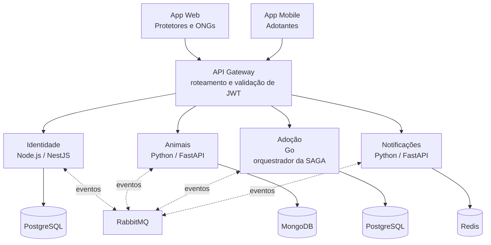
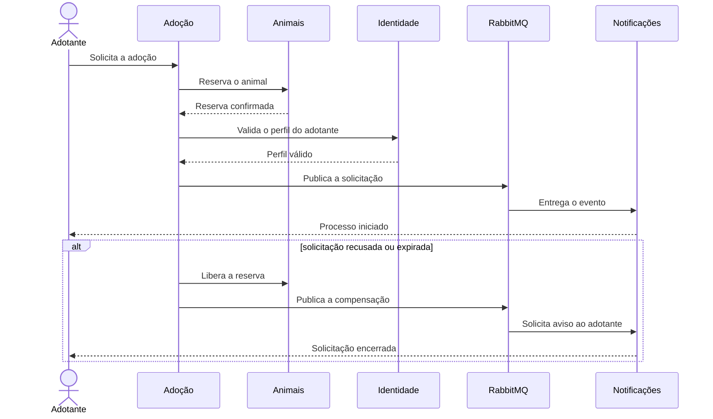

# Ampara

**Conectando protetores, ONGs e adotantes para dar um novo lar a quem precisa.**

A Ampara é uma plataforma que organiza o caminho entre o registro de um animal perdido, achado ou disponível para adoção e o encontro de alguém disposto a cuidar dele. O projeto reúne protetores independentes, ONGs e adotantes em um fluxo único, com localização, acompanhamento e notificações.

> Projeto acadêmico desenvolvido para a disciplina de Sistemas Distribuídos. Nesta primeira etapa, o repositório apresenta o problema, a proposta, o impacto esperado e a arquitetura que orientará a implementação.

[Problema](#o-problema) · [Solução](#como-a-ampara-funciona) · [Arquitetura](#arquitetura) · [SAGA](#saga-de-adoção) · [Impacto](#impacto-social) · [Documentação](#documentação)

## O problema

Hoje, boa parte dos avistamentos, pedidos de resgate e anúncios de adoção circula em grupos de WhatsApp e redes sociais. A informação se perde, o alcance depende de compartilhamentos e não existe um fluxo comum entre quem encontra o animal, quem pode resgatá-lo e quem quer adotar.

Os dados ajudam a dimensionar esse cenário:

| Indicador | Dado |
| --- | ---: |
| Animais domésticos em situação de abandono no Brasil | cerca de **30 milhões** [1] |
| Animais sob tutela de ONGs e grupos de protetores | cerca de **185 mil** [2] |
| Organizações consideradas no levantamento do Instituto Pet Brasil | aproximadamente **400** [2] |

O abandono também está ligado a problemas comportamentais, mudanças na rotina do tutor e à diferença entre a expectativa e os cuidados que o animal realmente exige [3]. Embora maus-tratos sejam crime e tenham penas ampliadas pela legislação brasileira [4], a resposta cotidiana ainda depende muito do trabalho de organizações e voluntários.

## Como a Ampara funciona

1. Um animal perdido, encontrado ou disponível para adoção é cadastrado com fotos, espécie, porte, localização e status.
2. A plataforma permite encontrar animais e denúncias próximas.
3. Protetores e ONGs gerenciam os animais sob sua responsabilidade pelo App Web.
4. Adotantes pesquisam pelo App Mobile e enviam uma solicitação de adoção.
5. A solicitação passa por reserva, validação do perfil e aprovação do responsável pelo animal.
6. A plataforma notifica os envolvidos a cada mudança importante do processo.

### Quem usa

| Público | Cliente | Principais ações |
| --- | --- | --- |
| Protetores e ONGs | **App Web** | cadastrar animais, atualizar status e acompanhar solicitações de adoção |
| Adotantes | **App Mobile** | buscar animais por localização, solicitar adoção e receber notificações |

## Requisitos atendidos pela proposta

| Requisito da disciplina | Proposta da Ampara |
| --- | --- |
| 4 microsserviços independentes | Identidade, Animais, Adoção e Notificações |
| 1 banco por microsserviço | 2 instâncias PostgreSQL, 1 MongoDB e 1 Redis, sem banco compartilhado |
| 2 clientes distintos | App Web e App Mobile |
| Transação distribuída | solicitação de adoção coordenada por uma SAGA que envolve os quatro serviços |
| Comunicação assíncrona | RabbitMQ como barramento de eventos |

## Arquitetura

O API Gateway é a entrada dos dois clientes. Ele faz o roteamento e a validação do token antes de encaminhar as chamadas. Cada microsserviço é responsável pelo próprio domínio e pelo próprio banco. Eventos que não precisam de resposta imediata passam pelo RabbitMQ.



### Responsabilidade de cada serviço

| Serviço | Tecnologia | Banco | Responsabilidade |
| --- | --- | --- | --- |
| **Identidade** | Node.js / NestJS | PostgreSQL | cadastro, autenticação e perfil de protetores, ONGs e adotantes |
| **Animais** | Python / FastAPI | MongoDB | cadastro, fotos, localização, status e reserva do animal |
| **Adoção** | Go | PostgreSQL | estado da solicitação e coordenação da SAGA de adoção |
| **Notificações** | Python / FastAPI | Redis | envio de avisos nas etapas relevantes do processo |

As decisões, limites dos serviços e fluxos de falha estão detalhados em [docs/arquitetura.md](docs/arquitetura.md).

## SAGA de adoção

Uma adoção não pode ser concluída por uma única operação de banco: ela depende de dados e ações mantidos por serviços diferentes. Por isso, o serviço de Adoção coordena a sequência e registra o andamento da transação.



Se o pedido for recusado ou expirar, a compensação devolve o animal ao estado disponível e avisa o adotante. Assim, uma solicitação incompleta não mantém o animal preso indefinidamente.

## Por que essa divisão

- **Identidade** concentra autenticação e perfis sem expor esses dados aos demais bancos.
- **Animais** mantém informações com estrutura variável, como características, fotos e localização.
- **Adoção** guarda o estado do processo e coordena as etapas que atravessam outros serviços.
- **Notificações** fica isolado do fluxo principal para que o envio de um aviso não determine sozinho o sucesso de uma operação de negócio.
- **RabbitMQ** reduz o acoplamento nas comunicações que podem acontecer de forma assíncrona.

## Impacto social

A Ampara pretende beneficiar animais em situação de abandono ou risco, ampliar o alcance de protetores e ONGs e tornar a busca dos adotantes mais organizada e transparente.

O impacto será acompanhado por quatro indicadores:

- adoções concluídas pela plataforma por período;
- tempo médio entre o registro de um avistamento ou denúncia e o resgate;
- tempo médio entre o cadastro do animal e a adoção;
- número de ONGs e protetores ativos e retenção mensal dessa rede.

## Estado atual

A Parte 1 corresponde à concepção do projeto. Ainda não há uma implementação executável. As próximas etapas transformarão esta arquitetura em serviços independentes, bancos isolados e dois clientes funcionais.

## Documentação

| Documento | Conteúdo |
| --- | --- |
| [Arquitetura técnica](docs/arquitetura.md) | limites dos serviços, comunicação, dados, SAGA e diretrizes de implementação |
| [Documento de concepção](docs/apresentacao/Ampara_Documento_Parte1.pdf) | problema, referências, impacto social e proposta inicial |
| [Decisão arquitetural](docs/decisoes/ADR-001-arquitetura-distribuida.md) | registro da arquitetura escolhida para a Parte 1 |
| [Contratos](docs/contratos/README.md) | convenções para os futuros contratos HTTP e eventos |
| [Roteiro da apresentação](docs/roteiro-apresentacao.md) | divisão da apresentação do GitHub entre os quatro integrantes |

## Organização do repositório

```text
.
├── docs/
│   ├── apresentacao/
│   ├── contratos/
│   ├── decisoes/
│   ├── arquitetura.md
│   └── roteiro-apresentacao.md
├── CONTRIBUTING.md
└── README.md
```

## Integrantes

| Integrante | GitHub |
| --- | --- |
| Gabriel Soares | [@gxbreus](https://github.com/gxbreus) |
| Gabriel Cantanhede | [@gabrlcant](https://github.com/gabrlcant) |
| Gabriel Nakazato | [@Gabriel-Nakazato](https://github.com/Gabriel-Nakazato) |
| Mateus Vitor | [@mateus-vitor-ferreira-dev](https://github.com/mateus-vitor-ferreira-dev) |

## Fluxo de contribuição

O desenvolvimento parte da branch `develop`. Cada funcionalidade deve ser criada em uma branch própria e integrada por pull request após revisão de outro integrante. As regras completas estão em [CONTRIBUTING.md](CONTRIBUTING.md).

## Referências

1. [AGÊNCIA BRASIL. Brasil tem cerca de 30 milhões de animais domésticos abandonados. Empresa Brasil de Comunicação (EBC), dez. 2025.](https://agenciabrasil.ebc.com.br/geral/noticia/2025-12/brasil-tem-cerca-de-30-milhoes-de-animais-domesticos-abandonados)
2. [INSTITUTO PET BRASIL (IPB). Levantamento nacional sobre animais abandonados ou resgatados sob tutela de ONGs e protetores. 2024.](https://web.archive.org/web/20250615212548/https://institutopetbrasil.com/fique-por-dentro/numero-de-animais-de-estimacao-em-situacao-de-vulnerabilidade-mais-do-que-dobra-em-dois-anos-aponta-pesquisa-do-ipb)
3. [CONSELHO REGIONAL DE MEDICINA VETERINÁRIA DO ESTADO DE SÃO PAULO (CRMV-SP). Revista de Educação Continuada em Medicina Veterinária e Zootecnia: pesquisa sobre fatores associados ao abandono de cães.](https://crmvsp.gov.br/animal-nao-e-brinquedo-adocao-ou-compra-de-um-pet-requer-planejamento/)
4. BRASIL. [Lei Federal nº 9.605, de 12 de fevereiro de 1998](https://www.planalto.gov.br/ccivil_03/leis/l9605.htm); [Lei Federal nº 14.064, de 29 de setembro de 2020](https://www.planalto.gov.br/ccivil_03/_ato2019-2022/2020/lei/l14064.htm).
5. Complementar: [COBASI CUIDA. Pesquisa Cenário de Abandono de Animais, 4ª edição, 2025.](https://blog.cobasi.com.br/pesquisa-cobasi-cuida-sobre-abandono-de-animais/)
