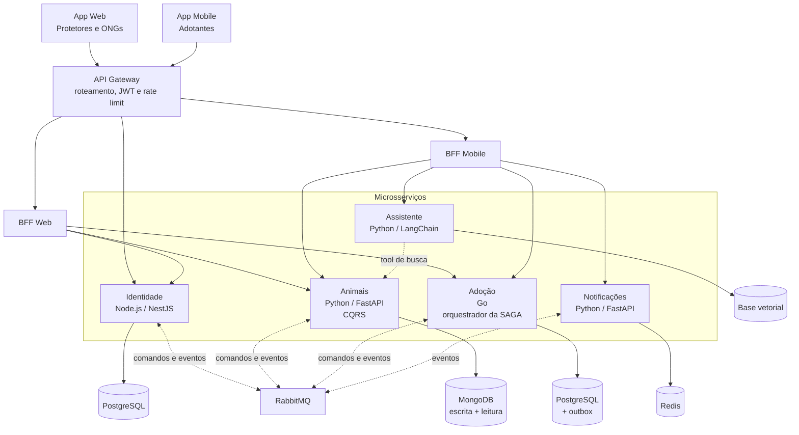
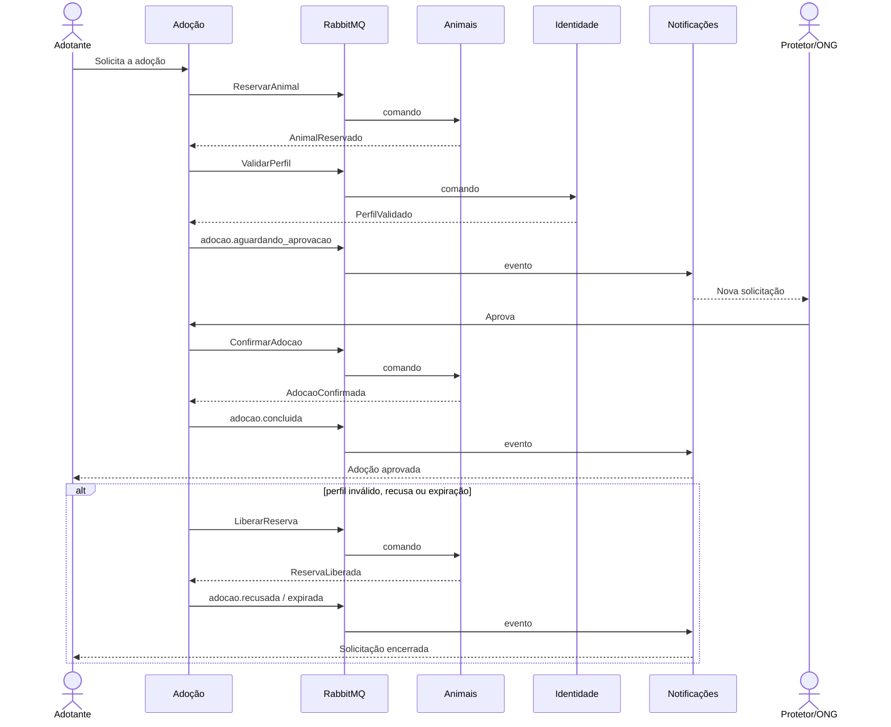

<p align="center">
  
</p>

# Ampara

**Conectando protetores, ONGs e adotantes para dar um novo lar a quem precisa.**

A Ampara é uma plataforma que organiza o caminho entre o registro de um animal perdido, achado ou disponível para adoção e o encontro de alguém disposto a cuidar dele. O projeto reúne protetores independentes, ONGs e adotantes em um fluxo único, com localização, acompanhamento e notificações.

> Projeto acadêmico desenvolvido para a disciplina de Sistemas Distribuídos. A Parte 1 (concepção e pitch) foi apresentada; agora o repositório concentra o projeto arquitetural da Parte 2 e o planejamento da implementação.

[Problema](#o-problema) · [Solução](#como-a-ampara-funciona) · [Arquitetura](#arquitetura) · [SAGA](#saga-de-adoção) · [Impacto](#impacto-social) · [Andamento](#andamento) · [Documentação](#documentação)

## O problema

Hoje, boa parte dos avistamentos, pedidos de resgate e anúncios de adoção circula em grupos de WhatsApp e redes sociais. A informação se perde, o alcance depende de compartilhamentos e não existe um fluxo comum entre quem encontra o animal, quem pode resgatá-lo e quem quer adotar.

Os dados ajudam a dimensionar esse cenário:

| Indicador | Dado |
| --- | ---: |
| Animais domésticos em situação de abandono no Brasil | cerca de **30 milhões** [1] |
| Animais sob tutela de ONGs e grupos de protetores | cerca de **185 mil** [2] |
| Organizações consideradas no levantamento do Instituto Pet Brasil | aproximadamente **400** [2] |

O abandono também está ligado a problemas comportamentais, mudanças na rotina do tutor e à diferença entre a expectativa e os cuidados que o animal realmente exige [3]. Embora maus-tratos sejam crime e tenham penas ampliadas pela legislação brasileira [4], a resposta cotidiana ainda depende muito do trabalho de organizações e voluntários.

## Como a Ampara funciona

1. Um animal perdido, encontrado ou disponível para adoção é cadastrado com fotos, espécie, porte, localização e status.
2. A plataforma permite encontrar animais próximos e, nas próximas entregas, avistamentos e denúncias.
3. Protetores e ONGs gerenciam os animais sob sua responsabilidade pelo App Web.
4. Adotantes pesquisam pelo App Mobile e enviam uma solicitação de adoção.
5. A solicitação passa por reserva, validação do perfil e aprovação do responsável pelo animal.
6. A plataforma notifica os envolvidos a cada mudança importante do processo.
7. Um assistente orienta o adotante sobre adoção responsável, com base em fontes confiáveis, e sugere animais compatíveis com a rotina dele.

### Quem usa

| Público | Cliente | Principais ações |
| --- | --- | --- |
| Protetores e ONGs | **App Web** | cadastrar animais, atualizar status e acompanhar solicitações de adoção |
| Adotantes | **App Mobile** | buscar animais por localização, solicitar adoção, receber notificações e consultar o assistente |

## Requisitos atendidos pela proposta

| Requisito da disciplina | Proposta da Ampara |
| --- | --- |
| 4 microsserviços independentes | Identidade, Animais, Adoção e Notificações, mais o **Assistente** (LLM) como 5º serviço |
| 1 banco por microsserviço | 2 PostgreSQL, 1 MongoDB, 1 Redis e 1 base vetorial, cada um em instância própria |
| 2 clientes distintos | App Web (protetores e ONGs) e App Mobile (adotantes) |
| API Gateway e Backend for Frontend | gateway como entrada única e um BFF para cada cliente |
| Transação distribuída (SAGA) | adoção orquestrada pelo serviço de Adoção, com comandos via RabbitMQ e compensações |
| Consistência e outbox | outbox em Adoção e Animais para publicar eventos sem dual write |
| CQRS | busca geográfica de animais servida por um modelo de leitura separado |
| LLM | RAG sobre guias de adoção responsável, LangChain com tool que consulta animais reais, e resiliência (circuit breaker, retry, cache e fallback) |

## Arquitetura

O API Gateway é a única entrada dos clientes: valida o token, aplica limites de requisição e encaminha cada chamada ao BFF do cliente. Cada BFF monta respostas sob medida para a sua tela: enxutas no mobile, completas no painel web. Os microsserviços não ficam expostos para fora, e cada um é dono do próprio banco. A comunicação que não precisa de resposta imediata, incluindo os passos da SAGA, passa pelo RabbitMQ.


```mermaid
flowchart TB
    Web[App Web<br/>Protetores e ONGs]
    Mobile[App Mobile<br/>Adotantes]
    Gateway[API Gateway<br/>roteamento, JWT e rate limit]

    Web --> Gateway
    Mobile --> Gateway

    Gateway --> BFFWeb[BFF Web]
    Gateway --> BFFMobile[BFF Mobile]
    Gateway --> Identidade

    subgraph Servicos[Microsserviços]
        Identidade[Identidade<br/>Node.js / NestJS]
        Animais[Animais<br/>Python / FastAPI<br/>CQRS]
        Adocao[Adoção<br/>Go<br/>orquestrador da SAGA]
        Notificacoes[Notificações<br/>Python / FastAPI]
        Assistente[Assistente<br/>Python / LangChain]
    end

    BFFWeb --> Identidade
    BFFWeb --> Animais
    BFFWeb --> Adocao
    BFFMobile --> Animais
    BFFMobile --> Adocao
    BFFMobile --> Notificacoes
    BFFMobile --> Assistente
    Assistente -. tool de busca .-> Animais

    Identidade --> DBIdentidade[(PostgreSQL)]
    Animais --> DBAnimais[(MongoDB<br/>escrita + leitura)]
    Adocao --> DBAdocao[(PostgreSQL<br/>+ outbox)]
    Notificacoes --> DBNotificacoes[(Redis)]
    Assistente --> DBAssistente[(Base vetorial)]

    Identidade <-. comandos e eventos .-> RabbitMQ[RabbitMQ]
    Animais <-. comandos e eventos .-> RabbitMQ
    Adocao <-. comandos e eventos .-> RabbitMQ
    Notificacoes <-. eventos .-> RabbitMQ
```

### Responsabilidade de cada serviço

| Serviço | Tecnologia | Banco | Responsabilidade |
| --- | --- | --- | --- |
| **Identidade** | Node.js / NestJS | PostgreSQL | cadastro, autenticação, perfil de adoção e verificação de protetores e ONGs |
| **Animais** | Python / FastAPI | MongoDB | cadastro, fotos, localização, status e reserva; busca por um modelo de leitura separado (CQRS) |
| **Adoção** | Go | PostgreSQL | estado da solicitação, orquestração da SAGA e outbox |
| **Notificações** | Python / FastAPI | Redis | avisos a cada etapa e caixa de notificações de cada usuário |
| **Assistente** | Python / LangChain | base vetorial | dúvidas sobre adoção responsável (RAG) e recomendação de animais compatíveis |
| **BFF Web** | Node.js | — | agrega dados para o painel de protetores e ONGs |
| **BFF Mobile** | Node.js | — | respostas enxutas e agregadas para o app do adotante |

Algumas tecnologias de borda (gateway, BFFs, base vetorial e clientes) ainda serão confirmadas pelo grupo. As decisões, os limites dos serviços e os fluxos de falha estão em [docs/arquitetura.md](docs/arquitetura.md) e em [docs/requisitos.md](docs/requisitos.md).

## SAGA de adoção

Uma adoção não pode ser concluída por uma única operação de banco: ela depende de dados e ações mantidos por serviços diferentes. O serviço de Adoção orquestra a sequência. Ele grava o estado e o próximo comando na mesma transação (outbox), e os participantes respondem pelo RabbitMQ. Assim, a SAGA continua de onde parou mesmo que um serviço fique fora do ar por um tempo.


```mermaid
sequenceDiagram
    actor Adotante
    participant A as Adoção
    participant R as RabbitMQ
    participant AN as Animais
    participant I as Identidade
    participant N as Notificações
    actor ONG as Protetor/ONG

    Adotante->>A: Solicita a adoção
    A->>R: ReservarAnimal
    R->>AN: comando
    AN-->>A: AnimalReservado
    A->>R: ValidarPerfil
    R->>I: comando
    I-->>A: PerfilValidado
    A->>R: adocao.aguardando_aprovacao
    R->>N: evento
    N-->>ONG: Nova solicitação
    ONG->>A: Aprova
    A->>R: ConfirmarAdocao
    R->>AN: comando
    AN-->>A: AdocaoConfirmada
    A->>R: adocao.concluida
    R->>N: evento
    N-->>Adotante: Adoção aprovada

    alt perfil inválido, recusa ou expiração
        A->>R: LiberarReserva
        R->>AN: comando
        AN-->>A: ReservaLiberada
        A->>R: adocao.recusada / expirada
        R->>N: evento
        N-->>Adotante: Solicitação encerrada
    end
```

Se o perfil do adotante estiver incompleto, se o responsável recusar ou se o prazo expirar, a compensação libera a reserva e avisa o adotante. Assim, uma solicitação incompleta não mantém o animal preso indefinidamente.

## Por que essa divisão

- **Identidade** concentra autenticação e perfis sem expor esses dados aos demais bancos.
- **Animais** mantém informações com estrutura variável, como características, fotos e localização, e separa a busca intensa do mobile das poucas escritas das ONGs.
- **Adoção** guarda o estado do processo e coordena as etapas que atravessam outros serviços.
- **Notificações** fica isolado do fluxo principal para que o envio de um aviso não determine sozinho o sucesso de uma operação de negócio.
- **Assistente** isola a latência, o custo e as falhas do modelo de linguagem: se ele cair, a busca e as adoções continuam funcionando.
- **BFFs** evitam que um cliente receba dados de que não precisa ou faça várias chamadas para montar uma tela.
- **RabbitMQ** reduz o acoplamento e permite que a SAGA sobreviva à indisponibilidade temporária de um participante.

## Impacto social

A Ampara pretende beneficiar animais em situação de abandono ou risco, ampliar o alcance de protetores e ONGs e tornar a busca dos adotantes mais organizada e transparente.

O impacto será acompanhado por quatro indicadores:

- adoções concluídas pela plataforma por período;
- tempo médio entre o registro de um avistamento ou denúncia e o resgate;
- tempo médio entre o cadastro do animal e a adoção;
- número de ONGs e protetores ativos e retenção mensal dessa rede.

## Andamento

| Etapa | Data | Situação |
| --- | --- | --- |
| Parte 1 — Concepção e pitch | 17/09 | apresentada |
| Parte 2 — Arquitetura | 22/10 ou 27/10 (repositório congela em 21/10 às 23h59) | em andamento |
| Parte 3 — Containerização e orquestração | 17/11 | planejada |
| Parte 4 — Sistema em funcionamento | 10/12 ou 15/12 (repositório congela em 09/12 às 23h59) | planejada |

As tarefas de cada etapa, com responsável e semana, estão no [board do projeto](https://github.com/users/mateus-vitor-ferreira-dev/projects/7).

### Situação de cada componente

| Componente | Pasta | Situação |
| --- | --- | --- |
| Adoção (SAGA) | [`services/adocao`](services/adocao) | implementado: SAGA, outbox, DLQ, Dockerfile e manifests do k8s |
| BFF Web | [`bff/web`](bff/web) | implementado: Dockerfile e manifests do k8s |
| Animais | [`services/animais`](services/animais) | base pronta (`/health`, testes, regras); o resto na #39 |
| Notificações | [`services/notificacoes`](services/notificacoes) | base pronta (`/health`, testes, regras); o resto na #41 |
| Assistente | [`services/assistente`](services/assistente) | base pronta (`/health`, testes, regras); o resto na #42 |
| Identidade | [`services/identidade`](services/identidade) | esqueleto em revisão (#98) |
| Gateway, BFF Mobile e apps | [`gateway`](gateway), [`bff/mobile`](bff/mobile), [`apps`](apps) | planejados; o README de cada pasta descreve o escopo |

Cada pasta tem um README com como rodar, a estrutura e o checklist do que falta. Os três serviços Python seguem o mesmo molde (`app/main.py` com `lifespan`, `config.py`, `dependencias.py` e a fixture `cliente` nos testes): quem conhece um sabe mexer nos outros.

## Como rodar

Precisa de Docker com o Compose. Na raiz do repositório:

```bash
cp .env.example .env
./scripts/gerar-chaves-jwt.sh      # par RS256 do JWT
# preencha as senhas no .env
docker compose up -d --build
```

Hoje o `compose.yaml` sobe os bancos, o RabbitMQ, a Adoção e o BFF Web. Cada serviço entra no compose na própria issue de esqueleto. Para rodar só um serviço Python durante o desenvolvimento, siga o README da pasta dele. O cluster local está em [`k8s/`](k8s/README.md).

A CI roda em todo PR e push para a `develop` e a `main`: gitleaks, validação dos contratos e, para cada componente alterado, lint, testes e `docker build`. Nos serviços Python, isso é `ruff check`, `ruff format --check` e `pytest`.

## Documentação

| Documento | Conteúdo |
| --- | --- |
| [Arquitetura técnica](docs/arquitetura.md) | limites dos serviços, comunicação, dados, SAGA e diretrizes de implementação |
| [Dados](docs/dados.md) e [SAGA](docs/saga.md) | database per service, consistência eventual e o fluxo da adoção |
| [Documento de concepção](docs/apresentacao/parte-1/Ampara_Documento_Parte1.pdf) e [pitch](docs/apresentacao/parte-1/ampara_pitch.pptx) | Parte 1: problema, referências, impacto social e proposta inicial |
| [Apresentação da Parte 2](docs/apresentacao/parte-2/README.md) | slides da arquitetura, com o PDF e o roteiro de quem apresenta cada parte |
| [Decisões arquiteturais](docs/decisoes/) | ADRs: arquitetura distribuída, SAGA orquestrada e outbox |
| [Contratos](docs/contratos/README.md) | OpenAPI da Adoção e do BFF Web, catálogo de eventos e convenções; os contratos dos outros serviços entram nas próprias issues |
| [Operação](docs/operacao/dlq.md) | como inspecionar e reprocessar a DLQ |
| [Requisitos](docs/requisitos.md) | requisitos das Partes 2 a 4, lacunas da arquitetura atual, histórias de usuário e MVP |
| [Planejamento](docs/planejamento.md) | escopo, divisão por integrante, cronograma, riscos e kickoff |
| [Board](https://github.com/users/mateus-vitor-ferreira-dev/projects/7) | tarefas por entrega, semana e integrante |

## Organização do repositório

```text
.
├── apps/              # front-ends web e mobile
├── bff/               # BFF Web e BFF Mobile
├── gateway/           # API Gateway, única porta exposta
├── services/          # adocao, animais, identidade, notificacoes, assistente
├── infra/             # imagens próprias do MongoDB e do RabbitMQ (definitions.json)
├── k8s/               # manifests do cluster local (kind + kustomize)
├── scripts/           # chaves do JWT, DLQ e roteiro da demo
├── docs/              # arquitetura, contratos, ADRs, requisitos e apresentações
├── compose.yaml       # o sistema inteiro com um comando
├── .env.example       # variáveis de ambiente, sem nenhum valor secreto
├── CONTRIBUTING.md
└── README.md
```

## Integrantes

| Integrante | GitHub |
| --- | --- |
| Gabriel Soares | [@gxbreus](https://github.com/gxbreus) |
| Gabriel Cantanhede | [@gabrlcant](https://github.com/gabrlcant) |
| Gabriel Nakazato | [@Gabriel-Nakazato](https://github.com/Gabriel-Nakazato) |
| Mateus Vitor | [@mateus-vitor-ferreira-dev](https://github.com/mateus-vitor-ferreira-dev) |

## Fluxo de contribuição

O desenvolvimento parte da branch `develop`. Cada funcionalidade deve ser criada em uma branch própria e integrada por pull request após revisão de outro integrante. As regras completas estão em [CONTRIBUTING.md](CONTRIBUTING.md).

## Referências

1. [AGÊNCIA BRASIL. Brasil tem cerca de 30 milhões de animais domésticos abandonados. Empresa Brasil de Comunicação (EBC), dez. 2025.](https://agenciabrasil.ebc.com.br/geral/noticia/2025-12/brasil-tem-cerca-de-30-milhoes-de-animais-domesticos-abandonados)
2. [INSTITUTO PET BRASIL (IPB). Levantamento nacional sobre animais abandonados ou resgatados sob tutela de ONGs e protetores. 2024.](https://web.archive.org/web/20250615212548/https://institutopetbrasil.com/fique-por-dentro/numero-de-animais-de-estimacao-em-situacao-de-vulnerabilidade-mais-do-que-dobra-em-dois-anos-aponta-pesquisa-do-ipb)
3. [CONSELHO REGIONAL DE MEDICINA VETERINÁRIA DO ESTADO DE SÃO PAULO (CRMV-SP). Revista de Educação Continuada em Medicina Veterinária e Zootecnia: pesquisa sobre fatores associados ao abandono de cães.](https://crmvsp.gov.br/animal-nao-e-brinquedo-adocao-ou-compra-de-um-pet-requer-planejamento/)
4. BRASIL. [Lei Federal nº 9.605, de 12 de fevereiro de 1998](https://www.planalto.gov.br/ccivil_03/leis/l9605.htm); [Lei Federal nº 14.064, de 29 de setembro de 2020](https://www.planalto.gov.br/ccivil_03/_ato2019-2022/2020/lei/l14064.htm).
5. Complementar: [COBASI CUIDA. Pesquisa Cenário de Abandono de Animais, 4ª edição, 2025.](https://blog.cobasi.com.br/pesquisa-cobasi-cuida-sobre-abandono-de-animais/)
