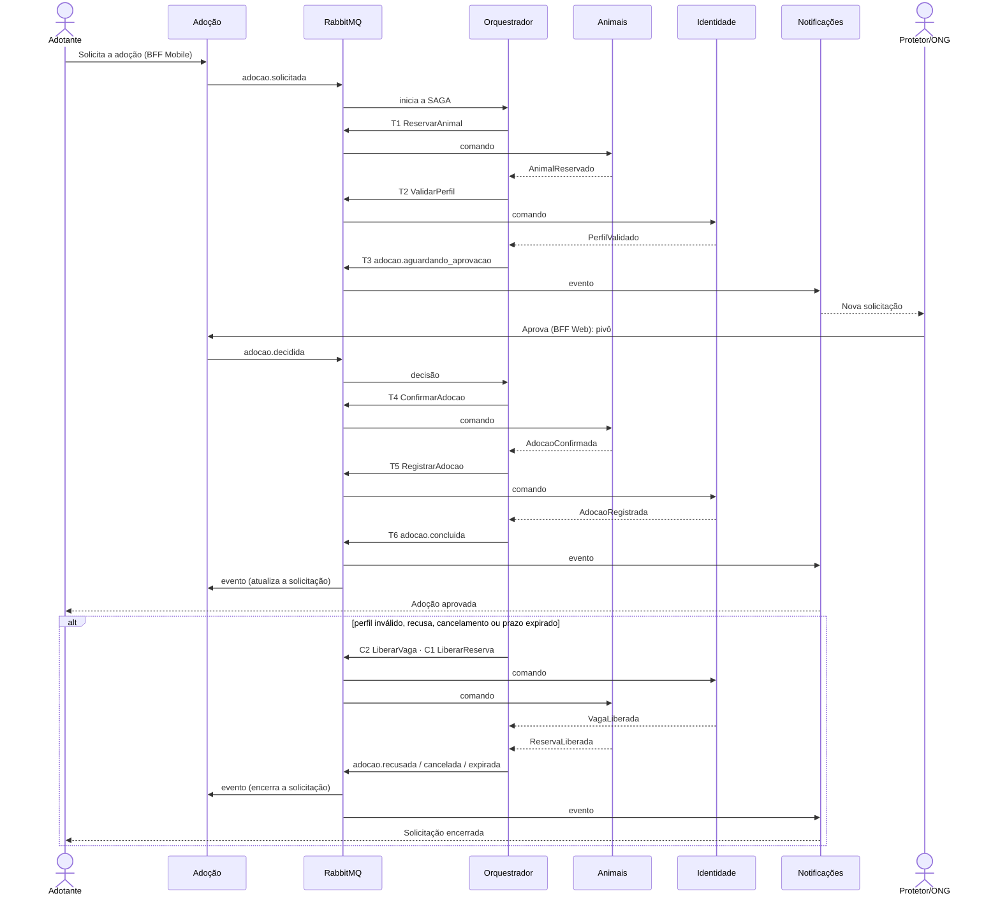

<p align="center">
  
</p>

# Ampara

**Conectando protetores, ONGs e adotantes para dar um novo lar a quem precisa.**

A Ampara é uma plataforma que organiza o caminho entre o registro de um animal perdido, achado ou disponível para adoção e o encontro de alguém disposto a cuidar dele. O projeto reúne protetores independentes, ONGs e adotantes em um fluxo único, com localização, acompanhamento e notificações.

> Projeto acadêmico desenvolvido para a disciplina de Sistemas Distribuídos. A Parte 1 (concepção e pitch) foi apresentada; agora o repositório concentra o projeto arquitetural da Parte 2 e o planejamento da implementação.

[Problema](#o-problema) · [Solução](#como-a-ampara-funciona) · [Arquitetura](#arquitetura) · [SAGA](#saga-de-adoção) · [Impacto](#impacto-social) · [Andamento](#andamento) · [Documentação](#documentação)

## O problema

Hoje, boa parte dos avistamentos, pedidos de resgate e anúncios de adoção circula em grupos de WhatsApp e redes sociais. A informação se perde, o alcance depende de compartilhamentos e não existe um fluxo comum entre quem encontra o animal, quem pode resgatá-lo e quem quer adotar.

Os dados ajudam a dimensionar esse cenário:

| Indicador | Dado |
| --- | ---: |
| Animais domésticos em situação de abandono no Brasil | cerca de **30 milhões** [1] |
| Animais sob tutela de ONGs e grupos de protetores | cerca de **185 mil** [2] |
| Organizações consideradas no levantamento do Instituto Pet Brasil | aproximadamente **400** [2] |

O abandono também está ligado a problemas comportamentais, mudanças na rotina do tutor e à diferença entre a expectativa e os cuidados que o animal realmente exige [3]. Embora maus-tratos sejam crime e tenham penas ampliadas pela legislação brasileira [4], a resposta cotidiana ainda depende muito do trabalho de organizações e voluntários.

## Como a Ampara funciona

1. Um animal perdido, encontrado ou disponível para adoção é cadastrado com fotos, espécie, porte, localização e status.
2. A plataforma permite encontrar animais próximos e, nas próximas entregas, avistamentos e denúncias.
3. Protetores e ONGs gerenciam os animais sob sua responsabilidade pelo App Web.
4. Adotantes pesquisam pelo App Mobile e enviam uma solicitação de adoção.
5. A solicitação passa por reserva, validação do perfil e aprovação do responsável pelo animal.
6. A plataforma notifica os envolvidos a cada mudança importante do processo.
7. Um assistente orienta o adotante sobre adoção responsável, com base em fontes confiáveis, e sugere animais compatíveis com a rotina dele.

### Quem usa

| Público | Cliente | Principais ações |
| --- | --- | --- |
| Protetores e ONGs | **App Web** | cadastrar animais, atualizar status e acompanhar solicitações de adoção |
| Adotantes | **App Mobile** | buscar animais por localização, solicitar adoção, receber notificações e consultar o assistente |

## Requisitos atendidos pela proposta

| Requisito da disciplina | Proposta da Ampara |
| --- | --- |
| 4 microsserviços independentes | 8 microsserviços: Identidade, Animais, Adoção, Notificações, Assistente (LLM), Orquestrador da SAGA, BFF Web e BFF Mobile |
| 1 banco por microsserviço | cada serviço com estado tem banco próprio, em instância própria: 3 PostgreSQL, 1 MongoDB, 1 Redis e 1 Qdrant (com cache Redis). Os BFFs não guardam estado |
| 2 clientes distintos | App Web (protetores e ONGs) e App Mobile (adotantes) |
| API Gateway e Backend for Frontend | Kong como entrada única e um BFF para cada cliente |
| Transação distribuída (SAGA) | adoção coordenada pelo **Orquestrador**, com comandos via RabbitMQ e compensações |
| Consistência e outbox | outbox em Adoção, Animais e Orquestrador para publicar mensagens sem dual write |
| CQRS | busca geográfica de animais servida por um banco de leitura separado do de escrita |
| LLM | RAG sobre guias de adoção responsável, LangChain com tool que consulta animais reais, e resiliência (circuit breaker, retry, cache e fallback) |

## Arquitetura

A Ampara é dividida em camadas, de cima para baixo:

1. **Clientes.** O App Web atende protetores e ONGs; o App Mobile atende adotantes.
2. **API Gateway (Kong).** É a única porta exposta: valida o JWT, aplica rate limit, gera o ID de correlação e encaminha cada rota externa (`/web/v1`, `/mobile/v1` e `/auth/v1`) ao serviço certo.
3. **Mensageria (RabbitMQ).** Fica logo abaixo do gateway como a camada comum a todos os microsserviços, inclusive os BFFs. Qualquer serviço pode publicar ou consumir mensagens nela sem conhecer o endereço dos outros. O gateway não se liga ao RabbitMQ: ele só encaminha HTTP (veja a observação abaixo do diagrama).
4. **Microsserviços.** São três grupos, todos implantados de forma independente:
   - **BFFs (borda):** um por cliente. Recebem a chamada do gateway, consultam os serviços de domínio por HTTP e devolvem a resposta no formato da tela: enxuta no mobile, completa no painel web. Também consomem eventos do RabbitMQ para atualizar a tela em tempo real. São microsserviços como os outros; a diferença é que não têm regra de negócio nem banco.
   - **Domínio:** Identidade, Animais, Adoção, Notificações e Assistente. Cada um é dono de uma parte do negócio e dos dados dela.
   - **Orquestrador:** coordena a SAGA de adoção. Não recebe chamadas dos clientes; trabalha só por mensagens.
5. **Dados.** Cada microsserviço com estado tem o próprio banco e ninguém lê o banco de outro serviço. Um dado de fora chega por uma chamada HTTP ou por um evento.


> **Por que não há seta entre o gateway e o RabbitMQ?** No diagrama, uma seta indica que um componente envia dados para outro, e o gateway não troca mensagens com o RabbitMQ. Ele recebe a requisição HTTP do cliente e precisa devolver a resposta nessa mesma conexão, então só encaminha para os BFFs (e para a Identidade, no login). Quem publica no RabbitMQ é o serviço dono do dado, na mesma transação do outbox, e o gateway não tem banco nem outbox. Além disso, o Kong OSS em modo DB-less não publica em filas AMQP. O RabbitMQ fica logo abaixo do gateway porque é a camada comum a todos os microsserviços, não porque o gateway fale com ele.

### Responsabilidade de cada microsserviço

| Microsserviço | Grupo | Tecnologia | Banco | Responsabilidade | Papel na SAGA |
| --- | --- | --- | --- | --- | --- |
| **BFF Web** | borda | Node.js | — | agrega dados para o painel de protetores e ONGs; consome `adocao.*` e `animal.*` para atualizar o painel em tempo real | encaminha a aprovação ou recusa do responsável para a Adoção |
| **BFF Mobile** | borda | Node.js | — | respostas enxutas e agregadas para o app do adotante; consome `adocao.*` para avisar o app em tempo real | encaminha o pedido de adoção para a Adoção |
| **Identidade** | domínio | Node.js / NestJS | PostgreSQL | cadastro, autenticação, perfil de adoção e verificação de protetores e ONGs | participante: valida o perfil, ocupa e libera a vaga do adotante |
| **Animais** | domínio | Python / FastAPI | MongoDB | cadastro, fotos, localização, status e reserva; busca por um banco de leitura separado (CQRS) | participante: reserva, libera a reserva e confirma a adoção |
| **Adoção** | domínio | Go | PostgreSQL | dados da solicitação, decisão do responsável e histórico mostrado ao usuário | inicia a SAGA e registra a decisão humana (o pivô) |
| **Notificações** | domínio | Python / FastAPI | Redis | avisos a cada etapa e caixa de notificações de cada usuário | consumidor: avisa adotante e responsável |
| **Assistente** | domínio | Python / LangChain | Qdrant + cache Redis | dúvidas sobre adoção responsável (RAG) e recomendação de animais compatíveis | não participa |
| **Orquestrador** | coordenação | Go | PostgreSQL | máquina de estados da SAGA, prazos, novas tentativas e compensações | coordenador: decide o próximo passo e quando compensar |

### Como os serviços conversam

- **HTTP (síncrono):** usado quando quem chama precisa da resposta para continuar. Os clientes falam só com o gateway, que encaminha aos BFFs (ou à Identidade, no login). Os BFFs chamam os serviços de domínio nas rotas internas `/v1`. O Assistente consulta Animais por uma tool de busca.
- **RabbitMQ (assíncrono):** usado quando quem envia não precisa esperar. São três exchanges:
  - `ampara.comandos`: o Orquestrador pede uma ação a um participante (por exemplo, `ReservarAnimal`);
  - `ampara.respostas`: o participante devolve o resultado ao Orquestrador (por exemplo, `AnimalReservado`);
  - `ampara.eventos`: fatos que já aconteceram, como `animal.criado` e `adocao.concluida`, consumidos por quem tiver interesse: Notificações, o projetor de Animais, a Adoção e os BFFs, que repassam a mudança para a tela aberta.
- **Outbox e inbox:** quem publica grava a mensagem na mesma transação do próprio dado (outbox), e um relay envia ao RabbitMQ depois. Assim, um dado salvo nunca fica sem a mensagem correspondente. Quem consome guarda o `messageId` já processado (inbox) e ignora reentregas. Mensagens que falham várias vezes vão para a DLQ.

### Onde entra a SAGA

A SAGA aparece no único fluxo que altera dados de vários serviços ao mesmo tempo: **a adoção**. Aprovar uma adoção exige reservar o animal (Animais), validar o adotante (Identidade), esperar a decisão do responsável (Adoção) e avisar as pessoas (Notificações). Não existe uma transação de banco que cubra quatro bancos diferentes. Por isso, cada passo é uma transação local, e cada passo que pode ser desfeito tem uma **compensação**.

Quem coordena é o **Orquestrador**, um microsserviço só para isso. A Adoção fica com o que o usuário vê (a solicitação e a decisão), e o Orquestrador fica com o controle do processo (qual passo está em andamento, o que fazer se um participante não responder e o que desfazer). O fluxo completo está na [próxima seção](#saga-de-adoção).

> **Mudança em andamento.** A máquina de estados da SAGA foi implementada dentro de [`services/adocao`](services/adocao) e será extraída para o Orquestrador. Até lá, a [ADR-002](docs/decisoes/ADR-002-saga-orquestrada.md), o [`docs/saga.md`](docs/saga.md) e o [catálogo de mensagens](docs/contratos/eventos.md) ainda descrevem a Adoção como orquestradora.

### CQRS em Animais: no banco, não só no código

Há duas formas de aplicar CQRS:

- **No código:** comandos (escrita) e consultas (leitura) ficam em classes e handlers separados, mas leem e gravam na mesma tabela ou coleção. A separação é só de organização.
- **No banco:** escrita e leitura usam bancos separados. A escrita grava no modelo completo, e um projetor alimentado por eventos monta um modelo pronto para a consulta. A leitura fica alguns segundos atrás da escrita (consistência eventual).

A Ampara aplica **CQRS no banco**, no serviço de Animais ([ADR-004](docs/decisoes/ADR-004-cqrs-animais.md)):

| | Escrita | Leitura |
| --- | --- | --- |
| Banco (MongoDB) | `animais` | `animais_leitura` |
| Quem usa | ONGs pelo BFF Web (cadastro, edição, status) | adotantes pelo BFF Mobile e o Assistente (busca por raio) |
| Conteúdo | documento completo: endereço e coordenadas exatos, histórico de status | dados públicos: localização arredondada em ~500 m, só bairro e cidade, nome e verificação da ONG já embutidos |
| Como é atualizado | pela API, na mesma transação do outbox | pelo projetor, que consome `animal.*` e `conta.verificada` do RabbitMQ |

O motivo não é só desempenho. O banco de leitura protege o endereço do animal (LGPD), evita chamar a Identidade a cada card da busca e deixa a defasagem visível na demonstração pelo campo `atualizadoEm`. Os dois bancos ficam na mesma instância do MongoDB, mas o serviço se conecta a eles por URLs diferentes (`ANIMAIS_MONGO_URL` e `ANIMAIS_LEITURA_MONGO_URL`). Mover a leitura para outra instância é só uma troca de configuração. Os detalhes estão em [`docs/cqrs.md`](docs/cqrs.md).

## SAGA de adoção

Uma adoção não pode ser concluída por uma única operação de banco: ela depende de dados e ações mantidos por serviços diferentes. O **Orquestrador** comanda a sequência. Ele grava o estado e o próximo comando na mesma transação (outbox), e os participantes respondem pelo RabbitMQ. Assim, a SAGA continua de onde parou mesmo que um serviço fique fora do ar por um tempo.


```mermaid
sequenceDiagram
    actor Adotante
    participant AD as Adoção
    participant R as RabbitMQ
    participant O as Orquestrador
    participant AN as Animais
    participant I as Identidade
    participant N as Notificações
    actor ONG as Protetor/ONG

    Adotante->>AD: Solicita a adoção (BFF Mobile)
    AD->>R: adocao.solicitada
    R->>O: inicia a SAGA
    O->>R: T1 ReservarAnimal
    R->>AN: comando
    AN-->>O: AnimalReservado
    O->>R: T2 ValidarPerfil
    R->>I: comando
    I-->>O: PerfilValidado
    O->>R: T3 adocao.aguardando_aprovacao
    R->>N: evento
    N-->>ONG: Nova solicitação
    ONG->>AD: Aprova (BFF Web): pivô
    AD->>R: adocao.decidida
    R->>O: decisão
    O->>R: T4 ConfirmarAdocao
    R->>AN: comando
    AN-->>O: AdocaoConfirmada
    O->>R: T5 RegistrarAdocao
    R->>I: comando
    I-->>O: AdocaoRegistrada
    O->>R: T6 adocao.concluida
    R->>N: evento
    R->>AD: evento (atualiza a solicitação)
    N-->>Adotante: Adoção aprovada

    alt perfil inválido, recusa, cancelamento ou prazo expirado
        O->>R: C2 LiberarVaga · C1 LiberarReserva
        R->>I: comando
        R->>AN: comando
        I-->>O: VagaLiberada
        AN-->>O: ReservaLiberada
        O->>R: adocao.recusada / cancelada / expirada
        R->>AD: evento (encerra a solicitação)
        R->>N: evento
        N-->>Adotante: Solicitação encerrada
    end
```

| Passo | O que acontece | Participante | Se der errado |
| --- | --- | --- | --- |
| T1 | reserva o animal | Animais | animal indisponível: encerra a solicitação sem compensar nada |
| T2 | valida o perfil e ocupa a vaga do adotante (1 solicitação ativa por vez) | Identidade | perfil inválido: C1 libera a reserva |
| T3 | avisa o responsável | Notificações | só reenvia; aviso não se desfaz |
| **Pivô** | o responsável aprova, recusa ou deixa o prazo de 72 h expirar | Adoção | recusa, cancelamento ou expiração: C2 libera a vaga e C1 libera a reserva |
| T4 | marca o animal como adotado | Animais | reenvia até dar certo |
| T5 | registra a adoção no histórico do adotante | Identidade | reenvia até dar certo |
| T6 | avisa adotante e responsável | Notificações | reenvia até dar certo |

O **pivô** é a aprovação humana. Antes dele, toda falha desfaz o que já foi feito, e o animal volta para a busca. Depois dele, os passos só são repetidos até dar certo, porque desfazer uma adoção aprovada não faz sentido para o negócio. Se um participante não responder no prazo, o Orquestrador reenvia o comando ou compensa. Os participantes ignoram comandos repetidos (inbox) e recusam comandos que chegam depois de uma compensação. Os estados, as transições e os cenários de falha estão em [`docs/saga.md`](docs/saga.md).

## Por que essa divisão

- **Identidade** concentra autenticação e perfis sem expor esses dados aos demais bancos.
- **Animais** mantém informações com estrutura variável, como características, fotos e localização, e separa a busca intensa do mobile das poucas escritas das ONGs.
- **Adoção** guarda a solicitação como o usuário a vê, sem misturar essa regra com o controle do processo distribuído.
- **Orquestrador** concentra o estado da SAGA, os prazos e as compensações em um só lugar: uma tabela mostra em que passo cada adoção está, e os participantes só precisam conhecer os próprios comandos.
- **Notificações** fica isolado do fluxo principal para que o envio de um aviso não determine sozinho o sucesso de uma operação de negócio.
- **Assistente** isola a latência, o custo e as falhas do modelo de linguagem: se ele cair, a busca e as adoções continuam funcionando.
- **BFFs** são microsserviços de borda: evitam que um cliente receba dados de que não precisa ou faça várias chamadas para montar uma tela, e cada um evolui no ritmo do próprio cliente.
- **RabbitMQ** é a camada comum a todos os microsserviços: reduz o acoplamento, permite que a SAGA sobreviva à indisponibilidade temporária de um participante e deixa os BFFs receberem mudanças sem consultar os serviços repetidamente.

## Impacto social

A Ampara pretende beneficiar animais em situação de abandono ou risco, ampliar o alcance de protetores e ONGs e tornar a busca dos adotantes mais organizada e transparente.

O impacto será acompanhado por quatro indicadores:

- adoções concluídas pela plataforma por período;
- tempo médio entre o registro de um avistamento ou denúncia e o resgate;
- tempo médio entre o cadastro do animal e a adoção;
- número de ONGs e protetores ativos e retenção mensal dessa rede.

## Andamento

| Etapa | Data | Situação |
| --- | --- | --- |
| Parte 1 — Concepção e pitch | 17/09 | apresentada |
| Parte 2 — Arquitetura | 22/10 ou 27/10 (repositório congela em 21/10 às 23h59) | em andamento |
| Parte 3 — Containerização e orquestração | 17/11 | planejada |
| Parte 4 — Sistema em funcionamento | 10/12 ou 15/12 (repositório congela em 09/12 às 23h59) | planejada |

As tarefas de cada etapa, com responsável e semana, estão no [board do projeto](https://github.com/users/mateus-vitor-ferreira-dev/projects/7).

### Situação de cada componente

| Componente | Pasta | Situação |
| --- | --- | --- |
| Adoção (SAGA) | [`services/adocao`](services/adocao) | implementado: SAGA, outbox, DLQ, Dockerfile e manifests do k8s |
| BFF Web | [`bff/web`](bff/web) | implementado: Dockerfile e manifests do k8s |
| Animais | [`services/animais`](services/animais) | esqueleto (#39) e escrita com transições de status e outbox (#55); o projetor do CQRS na #56 |
| Notificações | [`services/notificacoes`](services/notificacoes) | base pronta (`/health`, testes, regras); o resto na #41 |
| Assistente | [`services/assistente`](services/assistente) | base pronta (`/health`, testes, regras); o resto na #42 |
| Identidade | [`services/identidade`](services/identidade) | esqueleto pronto (#98) |
| Orquestrador | `services/orquestrador` | planejado: recebe a máquina de estados da SAGA que hoje está em `services/adocao` |
| Gateway, BFF Mobile e apps | [`gateway`](gateway), [`bff/mobile`](bff/mobile), [`apps`](apps) | planejados; o README de cada pasta descreve o escopo |

Cada pasta tem um README com como rodar, a estrutura e o checklist do que falta. Os três serviços Python seguem o mesmo molde (`app/main.py` com `lifespan`, `config.py`, `dependencias.py` e a fixture `cliente` nos testes): quem conhece um sabe mexer nos outros.

## Como rodar

Precisa de Docker com o Compose. Na raiz do repositório:

```bash
cp .env.example .env
./scripts/gerar-chaves-jwt.sh      # par RS256 do JWT
# preencha as senhas no .env
docker compose up -d --build
```

Hoje o `compose.yaml` sobe os bancos, o RabbitMQ, a Adoção, Animais, a Identidade e o BFF Web. Cada serviço entra no compose na própria issue de esqueleto. Para rodar só um serviço Python durante o desenvolvimento, siga o README da pasta dele. O cluster local está em [`k8s/`](k8s/README.md).

A CI roda em todo PR e push para a `develop` e a `main`: gitleaks, validação dos contratos e, para cada componente alterado, lint, testes e `docker build`. Nos serviços Python, isso é `ruff check`, `ruff format --check` e `pytest`.

## Documentação

| Documento | Conteúdo |
| --- | --- |
| [Arquitetura técnica](docs/arquitetura.md) | camadas, limites dos serviços, comunicação, dados, SAGA, CQRS e diretrizes de implementação |
| [Dados](docs/dados.md), [SAGA](docs/saga.md) e [CQRS](docs/cqrs.md) | database per service, consistência eventual, o fluxo da adoção e o modelo de leitura de Animais |
| [Documento de concepção](docs/apresentacao/parte-1/Ampara_Documento_Parte1.pdf) e [pitch](docs/apresentacao/parte-1/ampara_pitch.pptx) | Parte 1: problema, referências, impacto social e proposta inicial |
| [Apresentação da Parte 2](docs/apresentacao/parte-2/README.md) | slides da arquitetura, com o PDF e o roteiro de quem apresenta cada parte |
| [Decisões arquiteturais](docs/decisoes/) | ADRs: arquitetura distribuída, SAGA orquestrada, outbox, CQRS em Animais, gateway e BFFs, versionamento |
| [Contratos](docs/contratos/README.md) | OpenAPI de Adoção, Animais, Identidade, BFF Web e BFF Mobile, catálogo de eventos e convenções |
| [Operação](docs/operacao/dlq.md) | como inspecionar e reprocessar a DLQ |
| [Requisitos](docs/requisitos.md) | requisitos das Partes 2 a 4, lacunas da arquitetura atual, histórias de usuário e MVP |
| [Planejamento](docs/planejamento.md) | escopo, divisão por integrante, cronograma, riscos e kickoff |
| [Board](https://github.com/users/mateus-vitor-ferreira-dev/projects/7) | tarefas por entrega, semana e integrante |

## Organização do repositório

```text
.
├── apps/              # front-ends web e mobile
├── bff/               # BFF Web e BFF Mobile
├── gateway/           # API Gateway, única porta exposta
├── services/          # adocao, animais, identidade, notificacoes, assistente e, em breve, orquestrador
├── infra/             # imagens próprias do MongoDB e do RabbitMQ (definitions.json)
├── k8s/               # manifests do cluster local (kind + kustomize)
├── scripts/           # chaves do JWT, DLQ e roteiro da demo
├── docs/              # arquitetura, contratos, ADRs, requisitos e apresentações
├── compose.yaml       # o sistema inteiro com um comando
├── .env.example       # variáveis de ambiente, sem nenhum valor secreto
├── CONTRIBUTING.md
└── README.md
```

## Integrantes

| Integrante | GitHub |
| --- | --- |
| Gabriel Soares | [@gxbreus](https://github.com/gxbreus) |
| Gabriel Cantanhede | [@gabrlcant](https://github.com/gabrlcant) |
| Gabriel Nakazato | [@Gabriel-Nakazato](https://github.com/Gabriel-Nakazato) |
| Mateus Vitor | [@mateus-vitor-ferreira-dev](https://github.com/mateus-vitor-ferreira-dev) |

## Fluxo de contribuição

O desenvolvimento parte da branch `develop`. Cada funcionalidade deve ser criada em uma branch própria e integrada por pull request após revisão de outro integrante. As regras completas estão em [CONTRIBUTING.md](CONTRIBUTING.md).

## Referências

1. [AGÊNCIA BRASIL. Brasil tem cerca de 30 milhões de animais domésticos abandonados. Empresa Brasil de Comunicação (EBC), dez. 2025.](https://agenciabrasil.ebc.com.br/geral/noticia/2025-12/brasil-tem-cerca-de-30-milhoes-de-animais-domesticos-abandonados)
2. [INSTITUTO PET BRASIL (IPB). Levantamento nacional sobre animais abandonados ou resgatados sob tutela de ONGs e protetores. 2024.](https://web.archive.org/web/20250615212548/https://institutopetbrasil.com/fique-por-dentro/numero-de-animais-de-estimacao-em-situacao-de-vulnerabilidade-mais-do-que-dobra-em-dois-anos-aponta-pesquisa-do-ipb)
3. [CONSELHO REGIONAL DE MEDICINA VETERINÁRIA DO ESTADO DE SÃO PAULO (CRMV-SP). Revista de Educação Continuada em Medicina Veterinária e Zootecnia: pesquisa sobre fatores associados ao abandono de cães.](https://crmvsp.gov.br/animal-nao-e-brinquedo-adocao-ou-compra-de-um-pet-requer-planejamento/)
4. BRASIL. [Lei Federal nº 9.605, de 12 de fevereiro de 1998](https://www.planalto.gov.br/ccivil_03/leis/l9605.htm); [Lei Federal nº 14.064, de 29 de setembro de 2020](https://www.planalto.gov.br/ccivil_03/_ato2019-2022/2020/lei/l14064.htm).
5. Complementar: [COBASI CUIDA. Pesquisa Cenário de Abandono de Animais, 4ª edição, 2025.](https://blog.cobasi.com.br/pesquisa-cobasi-cuida-sobre-abandono-de-animais/)
