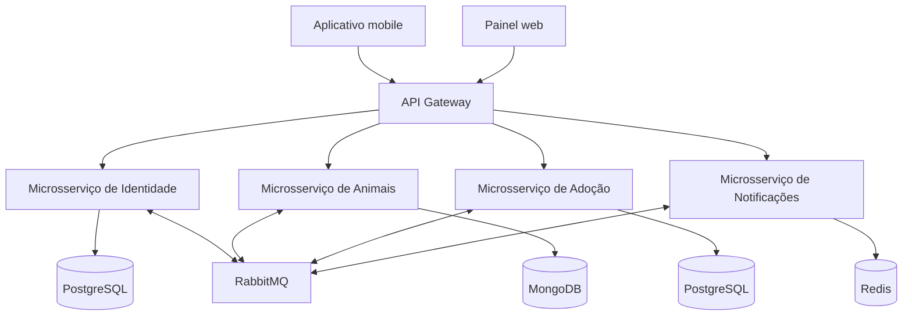
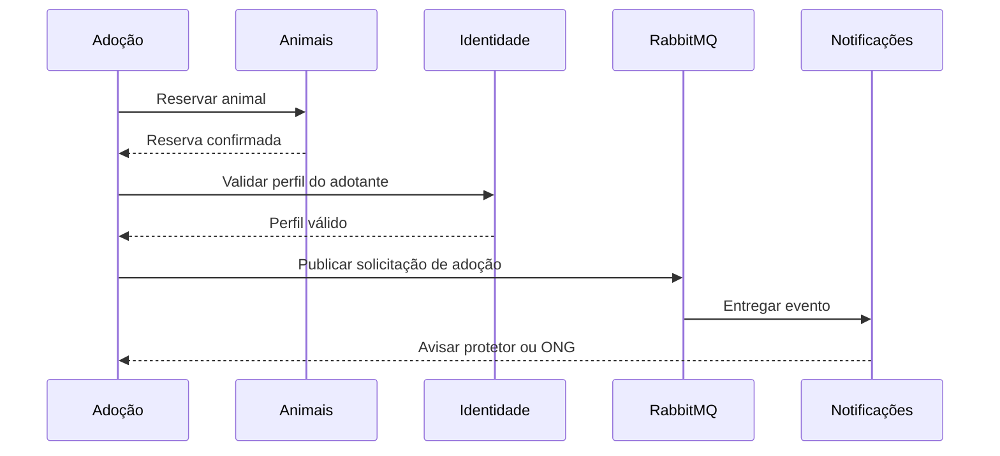

# Arquitetura da Ampara

## Visão geral

## Responsabilidades

### Identidade

Usa Node.js, NestJS e PostgreSQL. Mantém o cadastro, a autenticação e os perfis de protetores, ONGs e adotantes.

### Animais

Usa Python, FastAPI e MongoDB. Mantém cadastro, fotos, estado e localização. Também controla a reserva temporária durante uma solicitação de adoção.

### Adoção

Usa Go e PostgreSQL. Conduz o processo de adoção e atua como orquestrador da SAGA.

### Notificações

Usa Python, FastAPI e Redis. Envia avisos aos protetores, ONGs e adotantes nas etapas relevantes.

## Comunicação

- **API Gateway:** concentra roteamento e validação de JWT.
- **REST:** consultas e comandos que exigem resposta imediata passam pelo gateway.
- **Eventos:** mudanças relevantes são publicadas no RabbitMQ para reduzir o acoplamento entre serviços.
- **Dados:** cada serviço possui banco e credenciais próprios. Não existem consultas diretas ao banco de outro domínio.

## Clientes

- O aplicativo web permite que protetores e ONGs gerenciem animais e adoções.
- O aplicativo mobile permite que adotantes busquem animais próximos, solicitem adoções e recebam notificações.

## SAGA de conclusão da adoção

Se a solicitação for recusada ou expirar, o orquestrador solicita que Animais libere a reserva e publica um evento para Notificações avisar o adotante.
