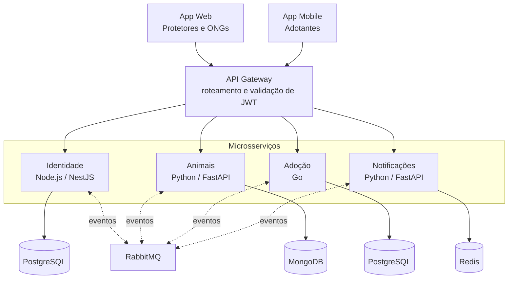
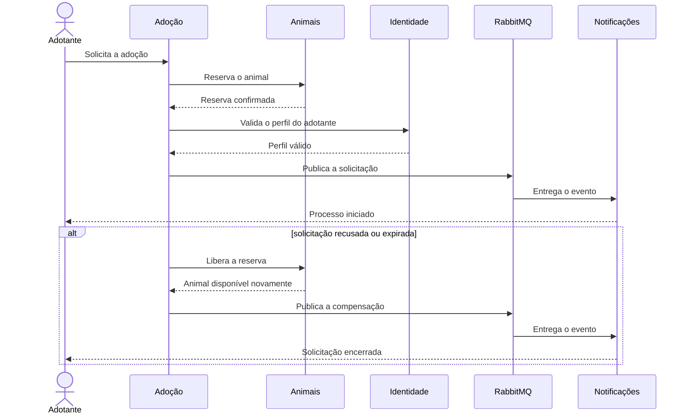

# Arquitetura da Ampara

Este documento registra a arquitetura planejada para orientar a implementação. Ele complementa o README com os limites de cada serviço, a propriedade dos dados e o comportamento da SAGA de adoção.

## Restrições do projeto

- quatro microsserviços independentes;
- um banco exclusivo por microsserviço;
- dois clientes com públicos diferentes;
- uma transação de negócio que atravesse pelo menos três serviços;
- execução local reproduzível nas próximas etapas.

## Visão geral

O API Gateway é o único ponto de entrada dos clientes. Os serviços não compartilham bancos e não consultam diretamente os dados uns dos outros.

## Limites dos serviços

### Identidade

Responsável pelo cadastro, autenticação e perfil de protetores, ONGs e adotantes. Outros serviços recebem apenas as informações necessárias para executar o próprio fluxo.

- **Tecnologia:** Node.js com NestJS
- **Banco:** PostgreSQL
- **Na SAGA:** informa se o perfil do adotante pode seguir no processo

### Animais

Mantém o cadastro do animal, fotos, características, localização, status e reserva temporária durante uma solicitação.

- **Tecnologia:** Python com FastAPI
- **Banco:** MongoDB
- **Na SAGA:** reserva o animal e libera essa reserva quando ocorre uma compensação

### Adoção

Mantém a solicitação de adoção e o estado de cada etapa. É o orquestrador da SAGA porque possui o contexto necessário para decidir o próximo passo ou iniciar uma compensação.

- **Tecnologia:** Go
- **Banco:** PostgreSQL
- **Na SAGA:** coordena reserva, validação, publicação de eventos e compensação

### Notificações

Recebe eventos e envia avisos a adotantes, protetores e ONGs. O isolamento impede que regras de envio fiquem espalhadas pelos demais serviços.

- **Tecnologia:** Python com FastAPI
- **Banco:** Redis
- **Na SAGA:** avisa o responsável pelo animal e comunica recusa ou expiração ao adotante

## Propriedade dos dados

| Dado | Serviço responsável | Armazenamento |
| --- | --- | --- |
| conta, autenticação e perfil | Identidade | PostgreSQL |
| animal, fotos, localização, status e reserva | Animais | MongoDB |
| solicitação e estado da SAGA | Adoção | PostgreSQL |
| estado necessário ao envio de notificações | Notificações | Redis |

Nenhum serviço acessa as tabelas ou coleções de outro. Quando um dado externo é necessário, a informação chega por uma chamada de serviço ou por um evento.

## Comunicação

### Síncrona

Chamadas que precisam de uma resposta para o fluxo continuar usam HTTP. Os clientes entram pelo API Gateway, que valida o JWT e encaminha a requisição ao serviço responsável.

### Assíncrona

Eventos passam pelo RabbitMQ. Esse caminho é usado quando o produtor não precisa aguardar a conclusão do consumidor, como no disparo de notificações.

## SAGA de adoção

### Compensações previstas

| Situação | Resposta do orquestrador |
| --- | --- |
| animal indisponível | encerra a solicitação antes de seguir para as demais etapas |
| perfil inválido | solicita a liberação da reserva do animal |
| solicitação recusada | libera a reserva e publica o evento de encerramento |
| solicitação expirada | libera a reserva e publica o evento de encerramento |
| falha temporária no envio do aviso | mantém o estado da adoção e permite nova tentativa do consumidor |

## Diretrizes para a implementação

Estas regras devem continuar válidas quando o código for criado:

1. cada serviço possui suas próprias credenciais e seu próprio banco;
2. nenhum cliente acessa um microsserviço sem passar pelo API Gateway;
3. o serviço de Adoção persiste o estado atual da SAGA antes de avançar para a próxima etapa;
4. consumidores de eventos devem aceitar reentregas sem repetir o efeito da mensagem;
5. chamadas e eventos da mesma solicitação devem carregar um identificador de correlação;
6. falhas de Notificações não podem apagar ou alterar o resultado já persistido da adoção;
7. contratos HTTP e eventos devem ser versionados em `docs/contratos`.

## Decisões e consequências

| Decisão | Motivo | Consequência |
| --- | --- | --- |
| banco por serviço | preservar autonomia e evitar acoplamento pelo banco | consultas entre domínios exigem chamadas ou eventos |
| Adoção como orquestrador | o serviço conhece o estado completo da solicitação | ele também precisa persistir e recuperar o andamento da SAGA |
| RabbitMQ para eventos | desacoplar produtores e consumidores | consumidores precisam tratar reentrega e indisponibilidade temporária |
| arquitetura poliglota | escolher tecnologias adequadas a cada responsabilidade | a execução local e a observabilidade precisam ser padronizadas |

## Próximos artefatos

- contratos OpenAPI dos serviços;
- catálogo dos eventos publicados no RabbitMQ;
- modelo de dados de cada banco;
- `compose.yaml` para execução local;
- estratégia de logs, métricas e rastreamento da SAGA.
