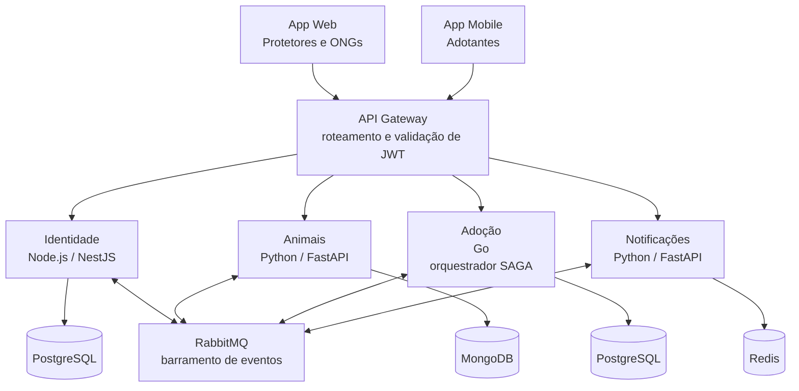
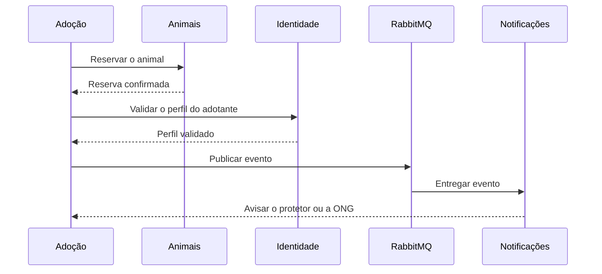

# Arquitetura técnica preliminar da Ampara

A arquitetura segue o slide final apresentado pelo grupo: quatro microsserviços independentes, um banco por serviço, dois clientes e uma SAGA orquestrada.

## Microsserviços

| Microsserviço | Tecnologia | Banco próprio | Responsabilidade |
| --- | --- | --- | --- |
| **Identidade** | Node.js / NestJS | PostgreSQL | Cadastro e autenticação de protetores, ONGs e adotantes. |
| **Animais** | Python / FastAPI | MongoDB | Cadastro de animais, fotos, status e localização. |
| **Adoção** | Go | PostgreSQL | Conduz o processo de adoção ponta a ponta e orquestra a SAGA. |
| **Notificações** | Python / FastAPI | Redis | Envio de notificações a cada etapa relevante. |

## Clientes

- **App Web:** voltado a protetores e ONGs, para gestão de animais e adoções.
- **App Mobile:** voltado a adotantes, com busca geolocalizada e notificações push.

## Comunicação entre serviços

- **API Gateway:** porta de entrada única, responsável pelo roteamento e pela validação de JWT.
- **RabbitMQ:** barramento de eventos para a comunicação assíncrona entre os serviços.

## Transação SAGA: processo de adoção

A solicitação de adoção atravessa quatro serviços: o serviço de Adoção reserva o animal junto ao serviço de Animais, valida o perfil do adotante junto ao serviço de Identidade e publica um evento no barramento. O serviço de Notificações avisa o protetor ou a ONG responsável para aprovação.

Se a solicitação for recusada ou expirar, uma transação de compensação libera a reserva do animal e notifica o adotante, garantindo que nenhum animal fique preso a um pedido pendente indefinidamente.
