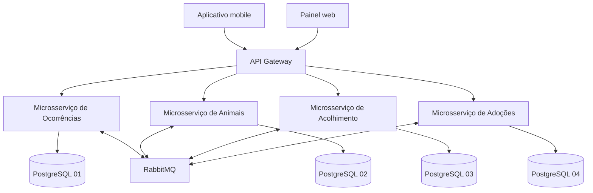
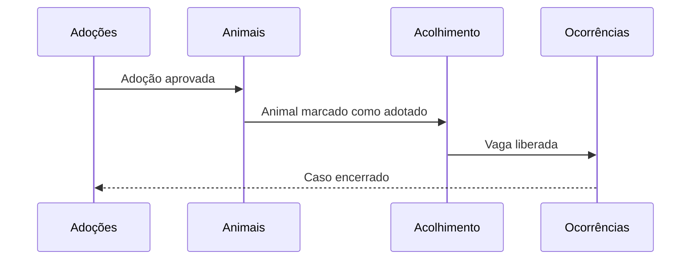

# Arquitetura da Ampara

## Visão geral

## Responsabilidades

### Ocorrências

Registra casos, avistamentos, localização aproximada, evidências e o estado do atendimento. Também decide quais regiões devem receber alertas.

### Animais

Mantém a identidade operacional do animal, suas características, informações de saúde e o estado atual. Outros serviços referenciam o identificador do animal, mas não acessam seu banco diretamente.

### Acolhimento

Administra ONGs, protetores, capacidade, reservas de vaga e entradas ou saídas dos animais.

### Adoções

Gerencia candidaturas, avaliação, aprovação, termo e acompanhamento após a adoção.

## Comunicação

- **REST:** consultas e comandos que exigem resposta imediata passam pelo API Gateway.
- **Eventos:** mudanças relevantes são publicadas no RabbitMQ para reduzir o acoplamento entre serviços.
- **Dados:** cada serviço possui banco e credenciais próprios. Não existem consultas diretas ao banco de outro domínio.

## Clientes

- O aplicativo mobile permite registrar ocorrência, acompanhar alertas e iniciar uma candidatura de adoção.
- O painel web permite que ONGs e protetores façam triagem, administrem vagas e avaliem candidaturas.

## SAGA de conclusão da adoção

Em uma falha, cada serviço executa sua compensação. O fluxo pode restaurar a vaga, devolver o animal ao estado disponível e reabrir a ocorrência.
