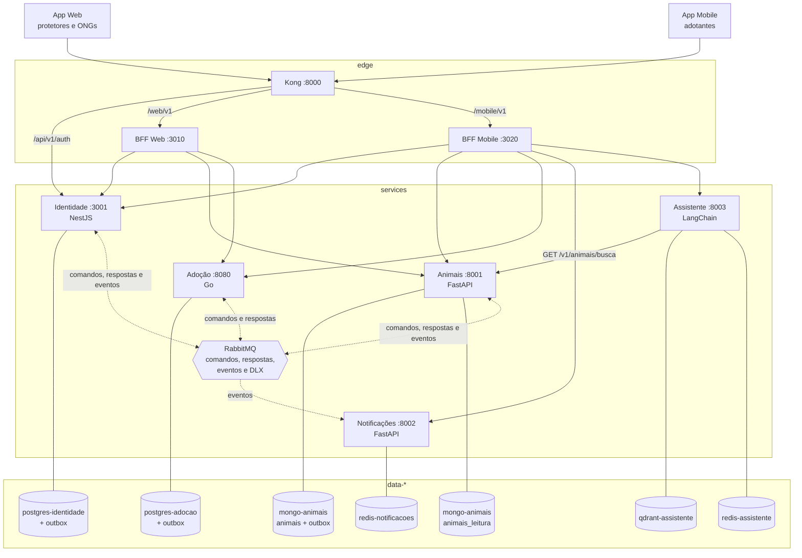
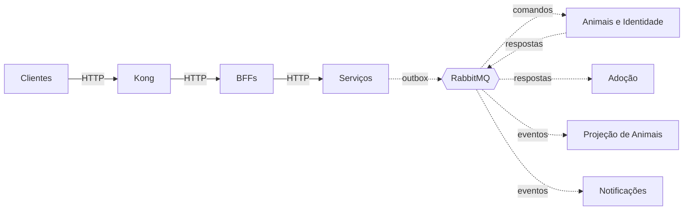

# Arquitetura da Ampara

A Ampara tem cinco microsserviços de domínio, cada um com o próprio banco, atrás de um API Gateway e de dois BFFs, um por cliente. A adoção atravessa três serviços numa SAGA orquestrada por mensagens no RabbitMQ.

Este documento mostra como as peças se encaixam e por que o sistema foi cortado assim. Os detalhes de cada mecanismo estão nos documentos da [última seção](#documentos-da-arquitetura).

## Restrições do projeto

- pelo menos quatro microsserviços independentes;
- um banco exclusivo por microsserviço;
- dois clientes com públicos diferentes;
- uma transação de negócio que atravesse pelo menos três serviços;
- execução local reproduzível, no Docker Compose e no Kubernetes.

## 1. Componentes

```mermaid
flowchart TB
    Web[App Web<br/>protetores e ONGs]
    Mob[App Mobile<br/>adotantes]

    subgraph edge[edge]
        GW[Kong :8000]
        BW[BFF Web :3010]
        BM[BFF Mobile :3020]
    end

    subgraph services[services]
        ID[Identidade :3001<br/>NestJS]
        AN[Animais :8001<br/>FastAPI]
        AD[Adoção :8080<br/>Go]
        NO[Notificações :8002<br/>FastAPI]
        AS[Assistente :8003<br/>LangChain]
        MQ{{RabbitMQ<br/>comandos, respostas,<br/>eventos e DLX}}
    end

    subgraph data[data-*]
        PG1[(postgres-identidade<br/>+ outbox)]
        MGW[(mongo-animais<br/>animais + outbox)]
        MGR[(mongo-animais<br/>animais_leitura)]
        PG2[(postgres-adocao<br/>+ outbox)]
        RD[(redis-notificacoes)]
        QD[(qdrant-assistente)]
        RC[(redis-assistente)]
    end

    Web --> GW
    Mob --> GW
    GW -->|/api/v1/auth| ID
    GW -->|/web/v1| BW
    GW -->|/mobile/v1| BM
    BW --> ID & AN & AD
    BM --> ID & AN & AD & NO & AS
    AS -->|GET /v1/animais/busca| AN

    ID --- PG1
    AN --- MGW
    AN --- MGR
    AD --- PG2
    NO --- RD
    AS --- QD
    AS --- RC

    AD <-. comandos e respostas .-> MQ
    AN <-. comandos, respostas e eventos .-> MQ
    ID <-. comandos, respostas e eventos .-> MQ
    MQ -. eventos .-> NO
```

Os grupos antecipam as redes do Compose (#37): o gateway e os BFFs ficam em `edge`, os serviços e o broker em `services`, e cada banco numa rede `data-<serviço>` que só o próprio serviço alcança. Os serviços de domínio não têm rota externa: tudo entra pelo Kong ([`gateway.md`](gateway.md)).

Animais aparece com dois cilindros na mesma instância do MongoDB: o modelo de escrita (`animais`) e a projeção de busca (`animais_leitura`), separados pelo CQRS.

## 2. Comunicação

```mermaid
flowchart LR
    C[Clientes] -->|HTTP| GW[Kong]
    GW -->|HTTP| BFF[BFFs]
    BFF -->|HTTP| S[Serviços]
    S -. outbox .-> MQ{{RabbitMQ}}
    MQ -. comandos .-> P[Animais e Identidade]
    P -. respostas .-> MQ
    MQ -. respostas .-> AD[Adoção]
    MQ -. eventos .-> PR[Projeção de Animais]
    MQ -. eventos .-> NO[Notificações]
```

| Interação | Tipo | Por quê |
| --- | --- | --- |
| cliente → gateway → BFF → serviço | HTTP síncrono | o usuário espera a resposta na tela |
| Assistente → Animais (busca) | HTTP síncrono | a recomendação precisa dos animais disponíveis agora, dentro da mesma pergunta |
| Adoção → participantes da SAGA | comandos e respostas no RabbitMQ | a SAGA sobrevive a um participante fora do ar: o comando espera na fila e a Adoção compensa no timeout |
| Animais → projeção de busca | eventos `animal.*` | a busca aceita alguns segundos de defasagem em troca de um modelo próprio para consultas por raio |
| Adoção e Identidade → Notificações | eventos `adocao.*` e `conta.verificada` | avisar não pode atrasar nem desfazer a adoção |

Toda mensagem sai pelo outbox do produtor e é deduplicada pela inbox do consumidor ([`dados.md`](dados.md), seção 5). Os nomes e formatos estão no [catálogo de mensagens](contratos/eventos.md).

## 3. Fronteiras dos serviços

Cada subseção diz pelo que o serviço responde, os dados que só ele possui, o que ele **não** faz e um corte alternativo que foi rejeitado.

### Identidade

*A escrever por @gxbreus. Deve incluir o corte rejeitado "um serviço único de usuários e animais".*

- **Responsável por:** …
- **Dados que possui:** …
- **Não faz:** …
- **Corte alternativo rejeitado:** …

### Animais

*A escrever por @gabrlcant.*

- **Responsável por:** …
- **Dados que possui:** …
- **Não faz:** …
- **Corte alternativo rejeitado:** …

### Adoção

- **Responsável por:** a solicitação de adoção do começo ao fim e a orquestração da SAGA: decide o próximo passo, dispara as compensações, controla os prazos (timeout de cada passo e expiração da decisão) e retoma as SAGAs em andamento quando reinicia.
- **Dados que possui:** solicitações e o estado da SAGA, a linha do tempo de cada solicitação, os passos com seus `messageId`, o outbox, a inbox e as chaves de idempotência do `POST`. Guarda uma cópia do nome do animal e do responsável, recebida em `AnimalReservado`.
- **Não faz:** não muda o status do animal nem ocupa a vaga do adotante: pede isso por comando a Animais e à Identidade, que decidem sobre os próprios dados. Não envia avisos: publica eventos, e Notificações decide quem avisar e como.
- **Corte alternativo rejeitado: Adoção dentro de Animais.** A reserva fica em Animais, então juntar os dois parece natural. Só que a SAGA também envolve a vaga do adotante, que é da Identidade, e uma espera humana de até 72 horas com estado próprio. Dentro de Animais, o catálogo, que muda pouco e é muito lido, passaria a carregar a máquina de estados, os prazos e as compensações. Uma queda no orquestrador derrubaria também a busca. Separados, cada um escala e falha sozinho: Animais pode ter 3 réplicas atendendo buscas sem mudar nada na SAGA.
- **Corte alternativo rejeitado: Notificações dentro de Adoção.** Avisar parece só o último passo da adoção. Mas Notificações também atende `conta.verificada`, que não tem relação com adoção, guarda a caixa de entrada de cada usuário e tem outro padrão de falha: um aviso atrasado não pode segurar nem desfazer uma adoção. Por isso a Adoção só publica fatos (`adocao.*`) e não espera ninguém consumir.

### Notificações

*A escrever por @Gabriel-Nakazato.*

- **Responsável por:** …
- **Dados que possui:** …
- **Não faz:** …
- **Corte alternativo rejeitado:** …

### Assistente

*A escrever por @Gabriel-Nakazato. Deve incluir o corte rejeitado "Assistente dentro de Animais" (ver também a ADR-007, #35).*

- **Responsável por:** …
- **Dados que possui:** …
- **Não faz:** …
- **Corte alternativo rejeitado:** …

### Borda: gateway e BFFs

O Kong é a única entrada: valida o JWT RS256, aplica rate limit, correlation ID e CORS, e não toma decisões de negócio. Cada cliente tem o próprio BFF, que agrega os serviços numa resposta por tela. O BFF Web monta o painel da ONG com dados de três serviços, e o BFF Mobile entrega cartões enxutos para o adotante. A decisão está na ADR-005, e a diferença entre as respostas em [`bff-comparacao.md`](contratos/bff-comparacao.md).

## 4. Propriedade dos dados

| Dado | Dono | Armazenamento |
| --- | --- | --- |
| contas, autenticação, perfil de adoção e vaga de solicitação | Identidade | `postgres-identidade` |
| animais, fotos, localização exata, status e reserva | Animais | `mongo-animais` (`animais`) |
| projeção de busca e cópia dos responsáveis verificados | Animais | `mongo-animais` (`animais_leitura`) |
| solicitações e estado da SAGA | Adoção | `postgres-adocao` |
| caixa de entrada de cada usuário | Notificações | `redis-notificacoes` (AOF) |
| base de conhecimento vetorial e cache de respostas | Assistente | `qdrant-assistente` e `redis-assistente` |

Nenhum serviço acessa o banco de outro. Um dado externo chega por chamada HTTP interna ou por mensagem. A justificativa de cada banco e os pontos de consistência eventual estão em [`dados.md`](dados.md).

## 5. SAGA de adoção

A Adoção orquestra a SAGA: reserva o animal em Animais (T1), valida o perfil e ocupa a vaga na Identidade (T2), avisa o responsável (T3) e espera a decisão. A aprovação é o pivô: depois dela, a SAGA confirma a adoção (T4), registra no histórico do adotante (T5) e avisa os dois lados (T6). Antes do pivô, toda falha desfaz o que já foi feito.

A máquina de estados, as 18 transições, os 17 cenários de falha e os diagramas de sequência estão em [`saga.md`](saga.md). A escolha de orquestrar por mensagens está na [ADR-002](decisoes/ADR-002-saga-orquestrada.md).

## 6. Diretrizes para a implementação

1. Cada serviço tem as próprias credenciais e o próprio banco.
2. Nenhum cliente acessa um serviço de domínio sem passar pelo gateway e por um BFF, exceto `/api/v1/auth/*`.
3. A Adoção grava o estado da SAGA e o próximo comando na mesma transação, antes de avançar.
4. Comando e evento só saem pelo outbox; todo consumidor deduplica pela inbox.
5. Mensagens e logs da mesma solicitação carregam `sagaId` e `correlationId`.
6. Falha de Notificações não altera o resultado já gravado da adoção.
7. Contratos HTTP e mensagens são versionados em `docs/contratos`, seguindo a ADR-006.

## 7. Decisões e consequências

| Decisão | Motivo | Consequência |
| --- | --- | --- |
| banco por serviço | autonomia e nenhum acoplamento pelo banco | consultas entre domínios exigem chamada ou evento |
| SAGA orquestrada pela Adoção, por mensagens | a Adoção conhece o estado inteiro; a SAGA sobrevive a um participante fora do ar | a Adoção precisa de outbox, inbox, timeouts e retomada |
| outbox e inbox | nenhuma mensagem se perde e nenhum efeito se repete | todo consumidor precisa ser idempotente |
| CQRS em Animais | a busca por raio tem outro formato e outra carga que a escrita | a busca mostra dados com alguns segundos de defasagem |
| gateway + um BFF por cliente | os clientes precisam de respostas diferentes e os serviços não ficam expostos | dois componentes a mais para operar |
| Assistente como serviço próprio | o LLM é lento, caro e falível; isolado, não derruba a busca nem a SAGA | mais um banco (vetorial) e uma chamada HTTP a Animais |
| arquitetura poliglota | a tecnologia adequada a cada responsabilidade | execução local e observabilidade precisam ser padronizadas |

## Documentos da arquitetura

| Documento | Conteúdo |
| --- | --- |
| [`saga.md`](saga.md) | estados, transições, compensações e diagramas da SAGA |
| [`dados.md`](dados.md) | banco por serviço, consistência eventual, outbox e inbox |
| `cqrs.md` (#33) | modelo de escrita, projeção de busca e defasagem em Animais |
| [`gateway.md`](gateway.md) | rotas externas e políticas do Kong |
| [`contratos/`](contratos/) | contratos OpenAPI de cada serviço e BFF, e o catálogo de mensagens |
| [`decisoes/`](decisoes/) | ADRs: arquitetura (001), SAGA (002), outbox (003), CQRS (004), gateway (005), versionamento (006) e Assistente (007) |
