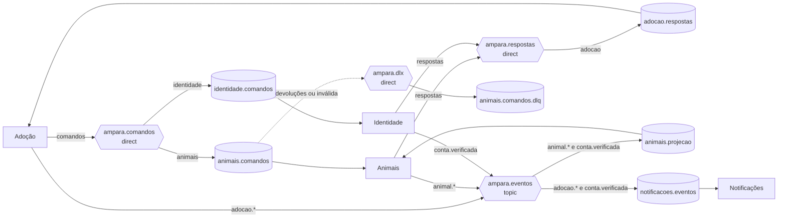

# Catálogo de mensagens do RabbitMQ

Este catálogo é o contrato das mensagens trocadas entre os serviços da Ampara: 6 comandos, 9 respostas e 11 eventos, todos na `version: 1`. Os passos e as transições que usam cada mensagem estão em [`docs/saga.md`](../saga.md).

Toda mensagem nova ou alterada entra aqui antes de entrar no código. A regra de versão segue a ADR-006 (#28).

## 1. Topologia



Toda fila tem a própria DLQ; o diagrama mostra só a de `animais.comandos` para não poluir.

### Exchanges

| Exchange | Tipo | Quem publica | Para quê |
| --- | --- | --- | --- |
| `ampara.comandos` | direct | Adoção | comandos da SAGA para um participante |
| `ampara.respostas` | direct | Animais, Identidade | respostas dos participantes ao orquestrador |
| `ampara.eventos` | topic | Adoção, Animais, Identidade (sempre pelo outbox) | fatos que já aconteceram |
| `ampara.dlx` | direct | o próprio RabbitMQ | mensagens mortas, roteadas para a DLQ da fila de origem |

### Filas

Todas são **quorum queues** duráveis, com `x-delivery-limit: 5`, `x-dead-letter-exchange: ampara.dlx` e `x-dead-letter-routing-key: <fila>.dlq`.

| Fila | Binding | Quem consome | DLQ |
| --- | --- | --- | --- |
| `animais.comandos` | `ampara.comandos` / `animais` | Animais | `animais.comandos.dlq` |
| `identidade.comandos` | `ampara.comandos` / `identidade` | Identidade | `identidade.comandos.dlq` |
| `adocao.respostas` | `ampara.respostas` / `adocao` | Adoção | `adocao.respostas.dlq` |
| `animais.projecao` | `ampara.eventos` / `animal.*` e `conta.verificada` | Animais (projetor) | `animais.projecao.dlq` |
| `notificacoes.eventos` | `ampara.eventos` / `adocao.*` e `conta.verificada` | Notificações | `notificacoes.eventos.dlq` |

A topologia é criada uma vez, pelo `definitions.json` do broker (#89). Nenhum serviço declara exchange ou fila no código.

## 2. Envelope

Toda mensagem é um JSON com o mesmo envelope. O conteúdo específico de cada mensagem vai em `payload`, descrito na ficha dela.

| Campo | Tipo | Descrição |
| --- | --- | --- |
| `messageId` | UUID | identifica esta mensagem; é a chave da inbox. Um reenvio por timeout mantém o mesmo valor |
| `type` | string | nome da mensagem, igual ao das fichas (`ReservarAnimal`, `adocao.aprovada`) |
| `version` | inteiro | versão do formato do `payload`; hoje, sempre `1` |
| `correlationId` | string | o `X-Correlation-Id` da requisição que originou a mensagem; vai para todos os logs |
| `sagaId` | UUID ou `null` | id da solicitação de adoção; `null` em `animal.*` fora da SAGA e em `conta.verificada` |
| `occurredAt` | data e hora (UTC) | quando o fato aconteceu ou o comando foi emitido; é por ele que os consumidores ordenam |
| `payload` | objeto | conteúdo da mensagem, conforme a ficha |

As propriedades AMQP repetem o envelope, para o broker e as ferramentas de inspeção: `message_id` = `messageId`, `type` = `type`, `correlation_id` = `correlationId`, `content_type: application/json` e `delivery_mode: 2` (persistente).

<details><summary>Schema do envelope e exemplo</summary>

```json
{
  "$schema": "https://json-schema.org/draft/2020-12/schema",
  "title": "Envelope de mensagem da Ampara",
  "type": "object",
  "additionalProperties": false,
  "required": ["messageId", "type", "version", "correlationId", "sagaId", "occurredAt", "payload"],
  "properties": {
    "messageId": { "type": "string", "format": "uuid" },
    "type": { "type": "string", "minLength": 1 },
    "version": { "type": "integer", "minimum": 1 },
    "correlationId": { "type": "string", "minLength": 1 },
    "sagaId": { "type": ["string", "null"], "format": "uuid" },
    "occurredAt": { "type": "string", "format": "date-time" },
    "payload": { "type": "object" }
  }
}
```

```json
{
  "messageId": "0b8f6c2e-91d4-4a7b-8e13-5c2f9a0d4e61",
  "type": "ReservarAnimal",
  "version": 1,
  "correlationId": "c-91a3f2",
  "sagaId": "7f1c2a9e-4b3d-4e8a-9c61-2d5f8e0b3a17",
  "occurredAt": "2026-11-17T15:00:00Z",
  "payload": { "animalId": "65a2f1c4e8b9d3a7f0c1b2d4" }
}
```

</details>

## 3. Resumo

Comando é imperativo (`ReservarAnimal`) e vai para um único consumidor. Resposta é o resultado de um comando e volta só para a Adoção. Evento é um fato no passado (`adocao.aprovada`) e pode ter vários consumidores.

| Mensagem | Tipo | Passo | Produtor → consumidor | Routing key |
| --- | --- | --- | --- | --- |
| [`ReservarAnimal`](#reservaranimal) | comando | T1 | Adoção → Animais | `animais` |
| [`AnimalReservado`](#animalreservado) | resposta | T1 | Animais → Adoção | `adocao` |
| [`ReservaRecusada`](#reservarecusada) | resposta | T1 | Animais → Adoção | `adocao` |
| [`LiberarReserva`](#liberarreserva) | comando | C1 | Adoção → Animais | `animais` |
| [`ReservaLiberada`](#reservaliberada) | resposta | C1 | Animais → Adoção | `adocao` |
| [`ConfirmarAdocao`](#confirmaradocao) | comando | T4 | Adoção → Animais | `animais` |
| [`AdocaoConfirmada`](#adocaoconfirmada) | resposta | T4 | Animais → Adoção | `adocao` |
| [`ConfirmacaoRecusada`](#confirmacaorecusada) | resposta | T4 | Animais → Adoção | `adocao` |
| [`ValidarPerfil`](#validarperfil) | comando | T2 | Adoção → Identidade | `identidade` |
| [`PerfilValidado`](#perfilvalidado) | resposta | T2 | Identidade → Adoção | `adocao` |
| [`PerfilRecusado`](#perfilrecusado) | resposta | T2 | Identidade → Adoção | `adocao` |
| [`LiberarVaga`](#liberarvaga) | comando | C2 | Adoção → Identidade | `identidade` |
| [`VagaLiberada`](#vagaliberada) | resposta | C2 | Identidade → Adoção | `adocao` |
| [`RegistrarAdocao`](#registraradocao) | comando | T5 | Adoção → Identidade | `identidade` |
| [`AdocaoRegistrada`](#adocaoregistrada) | resposta | T5 | Identidade → Adoção | `adocao` |
| [`adocao.aguardando_aprovacao`](#adocaoaguardando_aprovacao) | evento | T3 | Adoção → Notificações | `adocao.aguardando_aprovacao` |
| [`adocao.aprovada`](#adocaoaprovada) | evento | pivô | Adoção → Notificações | `adocao.aprovada` |
| [`adocao.concluida`](#adocaoconcluida) | evento | T6 | Adoção → Notificações | `adocao.concluida` |
| [`adocao.recusada`](#adocaorecusada) | evento | encerramento | Adoção → Notificações | `adocao.recusada` |
| [`adocao.cancelada`](#adocaocancelada) | evento | encerramento | Adoção → Notificações | `adocao.cancelada` |
| [`adocao.expirada`](#adocaoexpirada) | evento | encerramento | Adoção → Notificações | `adocao.expirada` |
| [`adocao.falhou`](#adocaofalhou) | evento | encerramento | Adoção → Notificações | `adocao.falhou` |
| [`animal.criado`](#animalcriado) | evento | — | Animais → Animais (projeção) | `animal.criado` |
| [`animal.atualizado`](#animalatualizado) | evento | — | Animais → Animais (projeção) | `animal.atualizado` |
| [`animal.status_alterado`](#animalstatus_alterado) | evento | — | Animais → Animais (projeção) | `animal.status_alterado` |
| [`conta.verificada`](#contaverificada) | evento | — | Identidade → Animais (projeção) e Notificações | `conta.verificada` |

## 4. Fichas

Os schemas descrevem só o `payload` e são JSON Schema 2020-12 válidos. Eles serão extraídos para `docs/contratos/mensagens/` e usados nos testes de contrato (#88). Todos usam `additionalProperties: false`: campo novo entra primeiro aqui, numa versão nova.

### Comandos e respostas com Animais

#### `ReservarAnimal`

Reserva atômica: `DISPONIVEL` → `RESERVADO` com `reservaSagaId = sagaId`, numa única operação condicional.

| | |
| --- | --- |
| Tipo | comando, `version: 1` |
| Passo da SAGA | T1 |
| Produtor | Adoção |
| Consumidor | Animais |
| Exchange / routing key | `ampara.comandos` / `animais` |
| Fila | `animais.comandos` |
| Respostas | `AnimalReservado` · `ReservaRecusada` |

<details><summary>Schema do payload e exemplo</summary>

```json
{
  "$schema": "https://json-schema.org/draft/2020-12/schema",
  "title": "ReservarAnimal v1 (payload)",
  "type": "object",
  "additionalProperties": false,
  "required": [
    "animalId"
  ],
  "properties": {
    "animalId": {
      "type": "string",
      "pattern": "^[0-9a-f]{24}$",
      "description": "ObjectId do animal no MongoDB"
    }
  }
}
```

```json
{
  "animalId": "65a2f1c4e8b9d3a7f0c1b2d4"
}
```

</details>

#### `AnimalReservado`

A Adoção guarda `animalNome` e `responsavelId` como snapshot na solicitação.

| | |
| --- | --- |
| Tipo | resposta, `version: 1` |
| Passo da SAGA | T1 |
| Produtor | Animais |
| Consumidor | Adoção |
| Exchange / routing key | `ampara.respostas` / `adocao` |
| Fila | `adocao.respostas` |

<details><summary>Schema do payload e exemplo</summary>

```json
{
  "$schema": "https://json-schema.org/draft/2020-12/schema",
  "title": "AnimalReservado v1 (payload)",
  "type": "object",
  "additionalProperties": false,
  "required": [
    "animalId",
    "responsavelId",
    "animalNome"
  ],
  "properties": {
    "animalId": {
      "type": "string",
      "pattern": "^[0-9a-f]{24}$",
      "description": "ObjectId do animal no MongoDB"
    },
    "responsavelId": {
      "type": "string",
      "format": "uuid"
    },
    "animalNome": {
      "type": "string"
    }
  }
}
```

```json
{
  "animalId": "65a2f1c4e8b9d3a7f0c1b2d4",
  "responsavelId": "c50a83ab-7db0-41b4-9436-4144c36f97d5",
  "animalNome": "Pipoca"
}
```

</details>

#### `ReservaRecusada`

`SAGA_ENCERRADA` = já existe a marca `sagas_compensadas` para este `sagaId`.

| | |
| --- | --- |
| Tipo | resposta, `version: 1` |
| Passo da SAGA | T1 |
| Produtor | Animais |
| Consumidor | Adoção |
| Exchange / routing key | `ampara.respostas` / `adocao` |
| Fila | `adocao.respostas` |

<details><summary>Schema do payload e exemplo</summary>

```json
{
  "$schema": "https://json-schema.org/draft/2020-12/schema",
  "title": "ReservaRecusada v1 (payload)",
  "type": "object",
  "additionalProperties": false,
  "required": [
    "animalId",
    "motivo"
  ],
  "properties": {
    "animalId": {
      "type": "string",
      "pattern": "^[0-9a-f]{24}$",
      "description": "ObjectId do animal no MongoDB"
    },
    "motivo": {
      "type": "string",
      "enum": [
        "INDISPONIVEL",
        "INEXISTENTE",
        "SAGA_ENCERRADA"
      ]
    }
  }
}
```

```json
{
  "animalId": "65a2f1c4e8b9d3a7f0c1b2d4",
  "motivo": "INDISPONIVEL"
}
```

</details>

#### `LiberarReserva`

Só libera se `reservaSagaId == sagaId`, e grava a marca `sagas_compensadas`. Pode ser bloqueante ou precautória (`docs/saga.md`).

| | |
| --- | --- |
| Tipo | comando, `version: 1` |
| Passo da SAGA | C1 |
| Produtor | Adoção |
| Consumidor | Animais |
| Exchange / routing key | `ampara.comandos` / `animais` |
| Fila | `animais.comandos` |
| Respostas | `ReservaLiberada` |

<details><summary>Schema do payload e exemplo</summary>

```json
{
  "$schema": "https://json-schema.org/draft/2020-12/schema",
  "title": "LiberarReserva v1 (payload)",
  "type": "object",
  "additionalProperties": false,
  "required": [
    "animalId"
  ],
  "properties": {
    "animalId": {
      "type": "string",
      "pattern": "^[0-9a-f]{24}$",
      "description": "ObjectId do animal no MongoDB"
    }
  }
}
```

```json
{
  "animalId": "65a2f1c4e8b9d3a7f0c1b2d4"
}
```

</details>

#### `ReservaLiberada`

Sempre responde, mesmo sem reserva a liberar (`liberou: false`).

| | |
| --- | --- |
| Tipo | resposta, `version: 1` |
| Passo da SAGA | C1 |
| Produtor | Animais |
| Consumidor | Adoção |
| Exchange / routing key | `ampara.respostas` / `adocao` |
| Fila | `adocao.respostas` |

<details><summary>Schema do payload e exemplo</summary>

```json
{
  "$schema": "https://json-schema.org/draft/2020-12/schema",
  "title": "ReservaLiberada v1 (payload)",
  "type": "object",
  "additionalProperties": false,
  "required": [
    "animalId",
    "liberou"
  ],
  "properties": {
    "animalId": {
      "type": "string",
      "pattern": "^[0-9a-f]{24}$",
      "description": "ObjectId do animal no MongoDB"
    },
    "liberou": {
      "type": "boolean"
    }
  }
}
```

```json
{
  "animalId": "65a2f1c4e8b9d3a7f0c1b2d4",
  "liberou": true
}
```

</details>

#### `ConfirmarAdocao`

Depois do pivô: `RESERVADO` → `ADOTADO`, só se a reserva for desta SAGA. Retentável, nunca compensado.

| | |
| --- | --- |
| Tipo | comando, `version: 1` |
| Passo da SAGA | T4 |
| Produtor | Adoção |
| Consumidor | Animais |
| Exchange / routing key | `ampara.comandos` / `animais` |
| Fila | `animais.comandos` |
| Respostas | `AdocaoConfirmada` · `ConfirmacaoRecusada` |

<details><summary>Schema do payload e exemplo</summary>

```json
{
  "$schema": "https://json-schema.org/draft/2020-12/schema",
  "title": "ConfirmarAdocao v1 (payload)",
  "type": "object",
  "additionalProperties": false,
  "required": [
    "animalId",
    "adotanteId"
  ],
  "properties": {
    "animalId": {
      "type": "string",
      "pattern": "^[0-9a-f]{24}$",
      "description": "ObjectId do animal no MongoDB"
    },
    "adotanteId": {
      "type": "string",
      "format": "uuid"
    }
  }
}
```

```json
{
  "animalId": "65a2f1c4e8b9d3a7f0c1b2d4",
  "adotanteId": "5aa91cf0-3811-4fe5-bb4f-4fdbef3e1d55"
}
```

</details>

#### `AdocaoConfirmada`

Leva a Adoção ao passo T5.

| | |
| --- | --- |
| Tipo | resposta, `version: 1` |
| Passo da SAGA | T4 |
| Produtor | Animais |
| Consumidor | Adoção |
| Exchange / routing key | `ampara.respostas` / `adocao` |
| Fila | `adocao.respostas` |

<details><summary>Schema do payload e exemplo</summary>

```json
{
  "$schema": "https://json-schema.org/draft/2020-12/schema",
  "title": "AdocaoConfirmada v1 (payload)",
  "type": "object",
  "additionalProperties": false,
  "required": [
    "animalId"
  ],
  "properties": {
    "animalId": {
      "type": "string",
      "pattern": "^[0-9a-f]{24}$",
      "description": "ObjectId do animal no MongoDB"
    }
  }
}
```

```json
{
  "animalId": "65a2f1c4e8b9d3a7f0c1b2d4"
}
```

</details>

#### `ConfirmacaoRecusada`

Invariante violada (transição 17 de `docs/saga.md`): a Adoção compensa e encerra em `FALHOU`.

| | |
| --- | --- |
| Tipo | resposta, `version: 1` |
| Passo da SAGA | T4 |
| Produtor | Animais |
| Consumidor | Adoção |
| Exchange / routing key | `ampara.respostas` / `adocao` |
| Fila | `adocao.respostas` |

<details><summary>Schema do payload e exemplo</summary>

```json
{
  "$schema": "https://json-schema.org/draft/2020-12/schema",
  "title": "ConfirmacaoRecusada v1 (payload)",
  "type": "object",
  "additionalProperties": false,
  "required": [
    "animalId",
    "motivo"
  ],
  "properties": {
    "animalId": {
      "type": "string",
      "pattern": "^[0-9a-f]{24}$",
      "description": "ObjectId do animal no MongoDB"
    },
    "motivo": {
      "type": "string",
      "enum": [
        "NAO_RESERVADO",
        "RESERVA_DE_OUTRA_SAGA"
      ]
    }
  }
}
```

```json
{
  "animalId": "65a2f1c4e8b9d3a7f0c1b2d4",
  "motivo": "NAO_RESERVADO"
}
```

</details>

### Comandos e respostas com Identidade

#### `ValidarPerfil`

Confere o perfil de adoção e ocupa a vaga (1 solicitação ativa por adotante), gravando o `sagaId`.

| | |
| --- | --- |
| Tipo | comando, `version: 1` |
| Passo da SAGA | T2 |
| Produtor | Adoção |
| Consumidor | Identidade |
| Exchange / routing key | `ampara.comandos` / `identidade` |
| Fila | `identidade.comandos` |
| Respostas | `PerfilValidado` · `PerfilRecusado` |

<details><summary>Schema do payload e exemplo</summary>

```json
{
  "$schema": "https://json-schema.org/draft/2020-12/schema",
  "title": "ValidarPerfil v1 (payload)",
  "type": "object",
  "additionalProperties": false,
  "required": [
    "adotanteId"
  ],
  "properties": {
    "adotanteId": {
      "type": "string",
      "format": "uuid"
    }
  }
}
```

```json
{
  "adotanteId": "5aa91cf0-3811-4fe5-bb4f-4fdbef3e1d55"
}
```

</details>

#### `PerfilValidado`

A vaga foi ocupada. A Adoção grava `AGUARDANDO_APROVACAO` e publica `adocao.aguardando_aprovacao` (T3).

| | |
| --- | --- |
| Tipo | resposta, `version: 1` |
| Passo da SAGA | T2 |
| Produtor | Identidade |
| Consumidor | Adoção |
| Exchange / routing key | `ampara.respostas` / `adocao` |
| Fila | `adocao.respostas` |

<details><summary>Schema do payload e exemplo</summary>

```json
{
  "$schema": "https://json-schema.org/draft/2020-12/schema",
  "title": "PerfilValidado v1 (payload)",
  "type": "object",
  "additionalProperties": false,
  "required": [
    "adotanteId"
  ],
  "properties": {
    "adotanteId": {
      "type": "string",
      "format": "uuid"
    }
  }
}
```

```json
{
  "adotanteId": "5aa91cf0-3811-4fe5-bb4f-4fdbef3e1d55"
}
```

</details>

#### `PerfilRecusado`

Não ocupa a vaga. `camposFaltando` vem preenchido quando o motivo é `PERFIL_INCOMPLETO`.

| | |
| --- | --- |
| Tipo | resposta, `version: 1` |
| Passo da SAGA | T2 |
| Produtor | Identidade |
| Consumidor | Adoção |
| Exchange / routing key | `ampara.respostas` / `adocao` |
| Fila | `adocao.respostas` |

<details><summary>Schema do payload e exemplo</summary>

```json
{
  "$schema": "https://json-schema.org/draft/2020-12/schema",
  "title": "PerfilRecusado v1 (payload)",
  "type": "object",
  "additionalProperties": false,
  "required": [
    "adotanteId",
    "motivo"
  ],
  "properties": {
    "adotanteId": {
      "type": "string",
      "format": "uuid"
    },
    "motivo": {
      "type": "string",
      "enum": [
        "PERFIL_INCOMPLETO",
        "LIMITE_SOLICITACOES",
        "CONTA_INEXISTENTE",
        "SAGA_ENCERRADA"
      ]
    },
    "camposFaltando": {
      "type": "array",
      "items": {
        "type": "string"
      }
    }
  }
}
```

```json
{
  "adotanteId": "5aa91cf0-3811-4fe5-bb4f-4fdbef3e1d55",
  "motivo": "PERFIL_INCOMPLETO",
  "camposFaltando": [
    "aceiteTermo"
  ]
}
```

</details>

#### `LiberarVaga`

Remove a vaga deste `sagaId` e grava a marca `sagas_compensadas`. Pode ser bloqueante ou precautória.

| | |
| --- | --- |
| Tipo | comando, `version: 1` |
| Passo da SAGA | C2 |
| Produtor | Adoção |
| Consumidor | Identidade |
| Exchange / routing key | `ampara.comandos` / `identidade` |
| Fila | `identidade.comandos` |
| Respostas | `VagaLiberada` |

<details><summary>Schema do payload e exemplo</summary>

```json
{
  "$schema": "https://json-schema.org/draft/2020-12/schema",
  "title": "LiberarVaga v1 (payload)",
  "type": "object",
  "additionalProperties": false,
  "required": [
    "adotanteId"
  ],
  "properties": {
    "adotanteId": {
      "type": "string",
      "format": "uuid"
    }
  }
}
```

```json
{
  "adotanteId": "5aa91cf0-3811-4fe5-bb4f-4fdbef3e1d55"
}
```

</details>

#### `VagaLiberada`

Sempre responde, mesmo sem vaga a liberar (`liberou: false`).

| | |
| --- | --- |
| Tipo | resposta, `version: 1` |
| Passo da SAGA | C2 |
| Produtor | Identidade |
| Consumidor | Adoção |
| Exchange / routing key | `ampara.respostas` / `adocao` |
| Fila | `adocao.respostas` |

<details><summary>Schema do payload e exemplo</summary>

```json
{
  "$schema": "https://json-schema.org/draft/2020-12/schema",
  "title": "VagaLiberada v1 (payload)",
  "type": "object",
  "additionalProperties": false,
  "required": [
    "adotanteId",
    "liberou"
  ],
  "properties": {
    "adotanteId": {
      "type": "string",
      "format": "uuid"
    },
    "liberou": {
      "type": "boolean"
    }
  }
}
```

```json
{
  "adotanteId": "5aa91cf0-3811-4fe5-bb4f-4fdbef3e1d55",
  "liberou": true
}
```

</details>

#### `RegistrarAdocao`

Grava a adoção no histórico do adotante e libera a vaga. Retentável.

| | |
| --- | --- |
| Tipo | comando, `version: 1` |
| Passo da SAGA | T5 |
| Produtor | Adoção |
| Consumidor | Identidade |
| Exchange / routing key | `ampara.comandos` / `identidade` |
| Fila | `identidade.comandos` |
| Respostas | `AdocaoRegistrada` |

<details><summary>Schema do payload e exemplo</summary>

```json
{
  "$schema": "https://json-schema.org/draft/2020-12/schema",
  "title": "RegistrarAdocao v1 (payload)",
  "type": "object",
  "additionalProperties": false,
  "required": [
    "adotanteId",
    "animalId"
  ],
  "properties": {
    "adotanteId": {
      "type": "string",
      "format": "uuid"
    },
    "animalId": {
      "type": "string",
      "pattern": "^[0-9a-f]{24}$",
      "description": "ObjectId do animal no MongoDB"
    }
  }
}
```

```json
{
  "adotanteId": "5aa91cf0-3811-4fe5-bb4f-4fdbef3e1d55",
  "animalId": "65a2f1c4e8b9d3a7f0c1b2d4"
}
```

</details>

#### `AdocaoRegistrada`

Leva a solicitação a `CONCLUIDA` e à publicação de `adocao.concluida` (T6).

| | |
| --- | --- |
| Tipo | resposta, `version: 1` |
| Passo da SAGA | T5 |
| Produtor | Identidade |
| Consumidor | Adoção |
| Exchange / routing key | `ampara.respostas` / `adocao` |
| Fila | `adocao.respostas` |

<details><summary>Schema do payload e exemplo</summary>

```json
{
  "$schema": "https://json-schema.org/draft/2020-12/schema",
  "title": "AdocaoRegistrada v1 (payload)",
  "type": "object",
  "additionalProperties": false,
  "required": [
    "adotanteId",
    "animalId"
  ],
  "properties": {
    "adotanteId": {
      "type": "string",
      "format": "uuid"
    },
    "animalId": {
      "type": "string",
      "pattern": "^[0-9a-f]{24}$",
      "description": "ObjectId do animal no MongoDB"
    }
  }
}
```

```json
{
  "adotanteId": "5aa91cf0-3811-4fe5-bb4f-4fdbef3e1d55",
  "animalId": "65a2f1c4e8b9d3a7f0c1b2d4"
}
```

</details>

### Eventos da Adoção

#### `adocao.aguardando_aprovacao`

Publicado na mesma transação que grava `AGUARDANDO_APROVACAO`. Avisa o responsável e o adotante.

| | |
| --- | --- |
| Tipo | evento, `version: 1` |
| Passo da SAGA | T3 |
| Produtor | Adoção |
| Consumidor | Notificações |
| Exchange / routing key | `ampara.eventos` / `adocao.aguardando_aprovacao` |
| Fila | `notificacoes.eventos` |

<details><summary>Schema do payload e exemplo</summary>

```json
{
  "$schema": "https://json-schema.org/draft/2020-12/schema",
  "title": "adocao.aguardando_aprovacao v1 (payload)",
  "type": "object",
  "additionalProperties": false,
  "required": [
    "solicitacaoId",
    "animalId",
    "animalNome",
    "adotanteId",
    "responsavelId",
    "expiraEm"
  ],
  "properties": {
    "solicitacaoId": {
      "type": "string",
      "format": "uuid"
    },
    "animalId": {
      "type": "string",
      "pattern": "^[0-9a-f]{24}$",
      "description": "ObjectId do animal no MongoDB"
    },
    "animalNome": {
      "type": "string"
    },
    "adotanteId": {
      "type": "string",
      "format": "uuid"
    },
    "responsavelId": {
      "type": "string",
      "format": "uuid"
    },
    "expiraEm": {
      "type": "string",
      "format": "date-time"
    }
  }
}
```

```json
{
  "solicitacaoId": "7f1c2a9e-4b3d-4e8a-9c61-2d5f8e0b3a17",
  "animalId": "65a2f1c4e8b9d3a7f0c1b2d4",
  "animalNome": "Pipoca",
  "adotanteId": "5aa91cf0-3811-4fe5-bb4f-4fdbef3e1d55",
  "responsavelId": "c50a83ab-7db0-41b4-9436-4144c36f97d5",
  "expiraEm": "2026-11-20T15:00:00Z"
}
```

</details>

#### `adocao.aprovada`

Sai junto com o `ConfirmarAdocao` (T4), na transição para `APROVADA`.

| | |
| --- | --- |
| Tipo | evento, `version: 1` |
| Passo da SAGA | pivô |
| Produtor | Adoção |
| Consumidor | Notificações |
| Exchange / routing key | `ampara.eventos` / `adocao.aprovada` |
| Fila | `notificacoes.eventos` |

<details><summary>Schema do payload e exemplo</summary>

```json
{
  "$schema": "https://json-schema.org/draft/2020-12/schema",
  "title": "adocao.aprovada v1 (payload)",
  "type": "object",
  "additionalProperties": false,
  "required": [
    "solicitacaoId",
    "animalId",
    "animalNome",
    "adotanteId",
    "responsavelId"
  ],
  "properties": {
    "solicitacaoId": {
      "type": "string",
      "format": "uuid"
    },
    "animalId": {
      "type": "string",
      "pattern": "^[0-9a-f]{24}$",
      "description": "ObjectId do animal no MongoDB"
    },
    "animalNome": {
      "type": "string"
    },
    "adotanteId": {
      "type": "string",
      "format": "uuid"
    },
    "responsavelId": {
      "type": "string",
      "format": "uuid"
    }
  }
}
```

```json
{
  "solicitacaoId": "7f1c2a9e-4b3d-4e8a-9c61-2d5f8e0b3a17",
  "animalId": "65a2f1c4e8b9d3a7f0c1b2d4",
  "animalNome": "Pipoca",
  "adotanteId": "5aa91cf0-3811-4fe5-bb4f-4fdbef3e1d55",
  "responsavelId": "c50a83ab-7db0-41b4-9436-4144c36f97d5"
}
```

</details>

#### `adocao.concluida`

Sai na transição para `CONCLUIDA`, depois de `AdocaoRegistrada`.

| | |
| --- | --- |
| Tipo | evento, `version: 1` |
| Passo da SAGA | T6 |
| Produtor | Adoção |
| Consumidor | Notificações |
| Exchange / routing key | `ampara.eventos` / `adocao.concluida` |
| Fila | `notificacoes.eventos` |

<details><summary>Schema do payload e exemplo</summary>

```json
{
  "$schema": "https://json-schema.org/draft/2020-12/schema",
  "title": "adocao.concluida v1 (payload)",
  "type": "object",
  "additionalProperties": false,
  "required": [
    "solicitacaoId",
    "animalId",
    "animalNome",
    "adotanteId",
    "responsavelId"
  ],
  "properties": {
    "solicitacaoId": {
      "type": "string",
      "format": "uuid"
    },
    "animalId": {
      "type": "string",
      "pattern": "^[0-9a-f]{24}$",
      "description": "ObjectId do animal no MongoDB"
    },
    "animalNome": {
      "type": "string"
    },
    "adotanteId": {
      "type": "string",
      "format": "uuid"
    },
    "responsavelId": {
      "type": "string",
      "format": "uuid"
    }
  }
}
```

```json
{
  "solicitacaoId": "7f1c2a9e-4b3d-4e8a-9c61-2d5f8e0b3a17",
  "animalId": "65a2f1c4e8b9d3a7f0c1b2d4",
  "animalNome": "Pipoca",
  "adotanteId": "5aa91cf0-3811-4fe5-bb4f-4fdbef3e1d55",
  "responsavelId": "c50a83ab-7db0-41b4-9436-4144c36f97d5"
}
```

</details>

#### `adocao.recusada`

Só sai depois de `VagaLiberada` e `ReservaLiberada`: o animal já voltou para a busca.

| | |
| --- | --- |
| Tipo | evento, `version: 1` |
| Passo da SAGA | encerramento |
| Produtor | Adoção |
| Consumidor | Notificações |
| Exchange / routing key | `ampara.eventos` / `adocao.recusada` |
| Fila | `notificacoes.eventos` |

<details><summary>Schema do payload e exemplo</summary>

```json
{
  "$schema": "https://json-schema.org/draft/2020-12/schema",
  "title": "adocao.recusada v1 (payload)",
  "type": "object",
  "additionalProperties": false,
  "required": [
    "solicitacaoId",
    "animalId",
    "animalNome",
    "adotanteId",
    "responsavelId",
    "motivo"
  ],
  "properties": {
    "solicitacaoId": {
      "type": "string",
      "format": "uuid"
    },
    "animalId": {
      "type": "string",
      "pattern": "^[0-9a-f]{24}$",
      "description": "ObjectId do animal no MongoDB"
    },
    "animalNome": {
      "type": "string"
    },
    "adotanteId": {
      "type": "string",
      "format": "uuid"
    },
    "responsavelId": {
      "type": "string",
      "format": "uuid"
    },
    "motivo": {
      "type": [
        "string",
        "null"
      ],
      "maxLength": 500
    }
  }
}
```

```json
{
  "solicitacaoId": "7f1c2a9e-4b3d-4e8a-9c61-2d5f8e0b3a17",
  "animalId": "65a2f1c4e8b9d3a7f0c1b2d4",
  "animalNome": "Pipoca",
  "adotanteId": "5aa91cf0-3811-4fe5-bb4f-4fdbef3e1d55",
  "responsavelId": "c50a83ab-7db0-41b4-9436-4144c36f97d5",
  "motivo": "Moradia sem tela de proteção nas janelas."
}
```

</details>

#### `adocao.cancelada`

Cancelamento pelo adotante. Só sai depois das duas compensações bloqueantes.

| | |
| --- | --- |
| Tipo | evento, `version: 1` |
| Passo da SAGA | encerramento |
| Produtor | Adoção |
| Consumidor | Notificações |
| Exchange / routing key | `ampara.eventos` / `adocao.cancelada` |
| Fila | `notificacoes.eventos` |

<details><summary>Schema do payload e exemplo</summary>

```json
{
  "$schema": "https://json-schema.org/draft/2020-12/schema",
  "title": "adocao.cancelada v1 (payload)",
  "type": "object",
  "additionalProperties": false,
  "required": [
    "solicitacaoId",
    "animalId",
    "animalNome",
    "adotanteId",
    "responsavelId"
  ],
  "properties": {
    "solicitacaoId": {
      "type": "string",
      "format": "uuid"
    },
    "animalId": {
      "type": "string",
      "pattern": "^[0-9a-f]{24}$",
      "description": "ObjectId do animal no MongoDB"
    },
    "animalNome": {
      "type": "string"
    },
    "adotanteId": {
      "type": "string",
      "format": "uuid"
    },
    "responsavelId": {
      "type": "string",
      "format": "uuid"
    }
  }
}
```

```json
{
  "solicitacaoId": "7f1c2a9e-4b3d-4e8a-9c61-2d5f8e0b3a17",
  "animalId": "65a2f1c4e8b9d3a7f0c1b2d4",
  "animalNome": "Pipoca",
  "adotanteId": "5aa91cf0-3811-4fe5-bb4f-4fdbef3e1d55",
  "responsavelId": "c50a83ab-7db0-41b4-9436-4144c36f97d5"
}
```

</details>

#### `adocao.expirada`

Prazo `ADOCAO_PRAZO_EXPIRACAO` vencido sem decisão. Só sai depois das duas compensações bloqueantes.

| | |
| --- | --- |
| Tipo | evento, `version: 1` |
| Passo da SAGA | encerramento |
| Produtor | Adoção |
| Consumidor | Notificações |
| Exchange / routing key | `ampara.eventos` / `adocao.expirada` |
| Fila | `notificacoes.eventos` |

<details><summary>Schema do payload e exemplo</summary>

```json
{
  "$schema": "https://json-schema.org/draft/2020-12/schema",
  "title": "adocao.expirada v1 (payload)",
  "type": "object",
  "additionalProperties": false,
  "required": [
    "solicitacaoId",
    "animalId",
    "animalNome",
    "adotanteId",
    "responsavelId"
  ],
  "properties": {
    "solicitacaoId": {
      "type": "string",
      "format": "uuid"
    },
    "animalId": {
      "type": "string",
      "pattern": "^[0-9a-f]{24}$",
      "description": "ObjectId do animal no MongoDB"
    },
    "animalNome": {
      "type": "string"
    },
    "adotanteId": {
      "type": "string",
      "format": "uuid"
    },
    "responsavelId": {
      "type": "string",
      "format": "uuid"
    }
  }
}
```

```json
{
  "solicitacaoId": "7f1c2a9e-4b3d-4e8a-9c61-2d5f8e0b3a17",
  "animalId": "65a2f1c4e8b9d3a7f0c1b2d4",
  "animalNome": "Pipoca",
  "adotanteId": "5aa91cf0-3811-4fe5-bb4f-4fdbef3e1d55",
  "responsavelId": "c50a83ab-7db0-41b4-9436-4144c36f97d5"
}
```

</details>

#### `adocao.falhou`

Cobre os estados finais `REJEITADA_INDISPONIVEL`, `PERFIL_INVALIDO` e `FALHOU`. Antes da reserva, `animalNome` e `responsavelId` ainda não são conhecidos e vêm `null`.

| | |
| --- | --- |
| Tipo | evento, `version: 1` |
| Passo da SAGA | encerramento |
| Produtor | Adoção |
| Consumidor | Notificações |
| Exchange / routing key | `ampara.eventos` / `adocao.falhou` |
| Fila | `notificacoes.eventos` |

<details><summary>Schema do payload e exemplo</summary>

```json
{
  "$schema": "https://json-schema.org/draft/2020-12/schema",
  "title": "adocao.falhou v1 (payload)",
  "type": "object",
  "additionalProperties": false,
  "required": [
    "solicitacaoId",
    "animalId",
    "animalNome",
    "adotanteId",
    "responsavelId",
    "estadoFinal",
    "motivo"
  ],
  "properties": {
    "solicitacaoId": {
      "type": "string",
      "format": "uuid"
    },
    "animalId": {
      "type": "string",
      "pattern": "^[0-9a-f]{24}$",
      "description": "ObjectId do animal no MongoDB"
    },
    "animalNome": {
      "type": [
        "string",
        "null"
      ]
    },
    "adotanteId": {
      "type": "string",
      "format": "uuid"
    },
    "responsavelId": {
      "type": [
        "string",
        "null"
      ],
      "format": "uuid"
    },
    "estadoFinal": {
      "type": "string",
      "enum": [
        "REJEITADA_INDISPONIVEL",
        "PERFIL_INVALIDO",
        "FALHOU"
      ]
    },
    "motivo": {
      "type": "string",
      "enum": [
        "INDISPONIVEL",
        "INEXISTENTE",
        "PERFIL_INCOMPLETO",
        "LIMITE_SOLICITACOES",
        "CONTA_INEXISTENTE",
        "TIMEOUT_T1",
        "TIMEOUT_T2",
        "CONFIRMACAO_RECUSADA"
      ]
    },
    "camposFaltando": {
      "type": "array",
      "items": {
        "type": "string"
      }
    }
  }
}
```

```json
{
  "solicitacaoId": "7f1c2a9e-4b3d-4e8a-9c61-2d5f8e0b3a17",
  "animalId": "65a2f1c4e8b9d3a7f0c1b2d4",
  "animalNome": "Pipoca",
  "adotanteId": "5aa91cf0-3811-4fe5-bb4f-4fdbef3e1d55",
  "responsavelId": "c50a83ab-7db0-41b4-9436-4144c36f97d5",
  "estadoFinal": "PERFIL_INVALIDO",
  "motivo": "PERFIL_INCOMPLETO",
  "camposFaltando": [
    "aceiteTermo"
  ]
}
```

</details>

### Eventos de Animais

#### `animal.criado`

Snapshot completo do animal (*event-carried state transfer*). Só traz o `pontoAproximado`: a coordenada exata nunca sai do modelo de escrita.

| | |
| --- | --- |
| Tipo | evento, `version: 1` |
| Produtor | Animais |
| Consumidor | Animais (projeção) |
| Exchange / routing key | `ampara.eventos` / `animal.criado` |
| Fila | `animais.projecao` |

<details><summary>Schema do payload e exemplo</summary>

```json
{
  "$schema": "https://json-schema.org/draft/2020-12/schema",
  "title": "animal.criado v1 (payload)",
  "type": "object",
  "additionalProperties": false,
  "required": [
    "animalId",
    "nome",
    "especie",
    "porte",
    "idadeMeses",
    "fotos",
    "fotoCapa",
    "fotoThumb",
    "pontoAproximado",
    "bairro",
    "cidade",
    "status",
    "responsavel",
    "version",
    "atualizadoEm"
  ],
  "properties": {
    "animalId": {
      "type": "string",
      "pattern": "^[0-9a-f]{24}$",
      "description": "ObjectId do animal no MongoDB"
    },
    "nome": {
      "type": "string",
      "minLength": 1
    },
    "especie": {
      "type": "string",
      "enum": [
        "CAO",
        "GATO",
        "OUTRO"
      ]
    },
    "porte": {
      "type": "string",
      "enum": [
        "PEQUENO",
        "MEDIO",
        "GRANDE"
      ]
    },
    "idadeMeses": {
      "type": "integer",
      "minimum": 0
    },
    "fotos": {
      "type": "array",
      "items": {
        "type": "string",
        "format": "uri"
      }
    },
    "fotoCapa": {
      "type": [
        "string",
        "null"
      ],
      "format": "uri"
    },
    "fotoThumb": {
      "type": [
        "string",
        "null"
      ],
      "format": "uri"
    },
    "pontoAproximado": {
      "type": "object",
      "additionalProperties": false,
      "required": [
        "type",
        "coordinates"
      ],
      "properties": {
        "type": {
          "const": "Point"
        },
        "coordinates": {
          "type": "array",
          "prefixItems": [
            {
              "type": "number"
            },
            {
              "type": "number"
            }
          ],
          "items": false,
          "minItems": 2
        }
      }
    },
    "bairro": {
      "type": "string"
    },
    "cidade": {
      "type": "string"
    },
    "status": {
      "type": "string",
      "enum": [
        "DISPONIVEL",
        "EM_TRATAMENTO",
        "INDISPONIVEL",
        "RESERVADO",
        "ADOTADO"
      ]
    },
    "responsavel": {
      "type": "object",
      "additionalProperties": false,
      "required": [
        "id",
        "nome",
        "verificado"
      ],
      "properties": {
        "id": {
          "type": "string",
          "format": "uuid"
        },
        "nome": {
          "type": "string"
        },
        "verificado": {
          "type": "boolean"
        }
      }
    },
    "version": {
      "type": "integer",
      "minimum": 1
    },
    "atualizadoEm": {
      "type": "string",
      "format": "date-time"
    }
  }
}
```

```json
{
  "animalId": "65a2f1c4e8b9d3a7f0c1b2d4",
  "nome": "Pipoca",
  "especie": "GATO",
  "porte": "PEQUENO",
  "idadeMeses": 14,
  "fotos": [
    "https://exemplo.ampara.dev/fotos/pipoca-1.jpg"
  ],
  "fotoCapa": "https://exemplo.ampara.dev/fotos/pipoca-1.jpg",
  "fotoThumb": "https://exemplo.ampara.dev/fotos/pipoca-1-thumb.jpg",
  "pontoAproximado": {
    "type": "Point",
    "coordinates": [
      -45.0,
      -21.245
    ]
  },
  "bairro": "Centro",
  "cidade": "Lavras",
  "status": "DISPONIVEL",
  "responsavel": {
    "id": "c50a83ab-7db0-41b4-9436-4144c36f97d5",
    "nome": "ONG Patas de Lavras",
    "verificado": true
  },
  "version": 1,
  "atualizadoEm": "2026-11-17T14:00:00Z"
}
```

</details>

#### `animal.atualizado`

Mesmo snapshot do `animal.criado`. O projetor faz upsert por `version` e descarta versões antigas.

| | |
| --- | --- |
| Tipo | evento, `version: 1` |
| Produtor | Animais |
| Consumidor | Animais (projeção) |
| Exchange / routing key | `ampara.eventos` / `animal.atualizado` |
| Fila | `animais.projecao` |

<details><summary>Schema do payload e exemplo</summary>

```json
{
  "$schema": "https://json-schema.org/draft/2020-12/schema",
  "title": "animal.atualizado v1 (payload)",
  "type": "object",
  "additionalProperties": false,
  "required": [
    "animalId",
    "nome",
    "especie",
    "porte",
    "idadeMeses",
    "fotos",
    "fotoCapa",
    "fotoThumb",
    "pontoAproximado",
    "bairro",
    "cidade",
    "status",
    "responsavel",
    "version",
    "atualizadoEm"
  ],
  "properties": {
    "animalId": {
      "type": "string",
      "pattern": "^[0-9a-f]{24}$",
      "description": "ObjectId do animal no MongoDB"
    },
    "nome": {
      "type": "string",
      "minLength": 1
    },
    "especie": {
      "type": "string",
      "enum": [
        "CAO",
        "GATO",
        "OUTRO"
      ]
    },
    "porte": {
      "type": "string",
      "enum": [
        "PEQUENO",
        "MEDIO",
        "GRANDE"
      ]
    },
    "idadeMeses": {
      "type": "integer",
      "minimum": 0
    },
    "fotos": {
      "type": "array",
      "items": {
        "type": "string",
        "format": "uri"
      }
    },
    "fotoCapa": {
      "type": [
        "string",
        "null"
      ],
      "format": "uri"
    },
    "fotoThumb": {
      "type": [
        "string",
        "null"
      ],
      "format": "uri"
    },
    "pontoAproximado": {
      "type": "object",
      "additionalProperties": false,
      "required": [
        "type",
        "coordinates"
      ],
      "properties": {
        "type": {
          "const": "Point"
        },
        "coordinates": {
          "type": "array",
          "prefixItems": [
            {
              "type": "number"
            },
            {
              "type": "number"
            }
          ],
          "items": false,
          "minItems": 2
        }
      }
    },
    "bairro": {
      "type": "string"
    },
    "cidade": {
      "type": "string"
    },
    "status": {
      "type": "string",
      "enum": [
        "DISPONIVEL",
        "EM_TRATAMENTO",
        "INDISPONIVEL",
        "RESERVADO",
        "ADOTADO"
      ]
    },
    "responsavel": {
      "type": "object",
      "additionalProperties": false,
      "required": [
        "id",
        "nome",
        "verificado"
      ],
      "properties": {
        "id": {
          "type": "string",
          "format": "uuid"
        },
        "nome": {
          "type": "string"
        },
        "verificado": {
          "type": "boolean"
        }
      }
    },
    "version": {
      "type": "integer",
      "minimum": 1
    },
    "atualizadoEm": {
      "type": "string",
      "format": "date-time"
    }
  }
}
```

```json
{
  "animalId": "65a2f1c4e8b9d3a7f0c1b2d4",
  "nome": "Pipoca",
  "especie": "GATO",
  "porte": "PEQUENO",
  "idadeMeses": 15,
  "fotos": [
    "https://exemplo.ampara.dev/fotos/pipoca-1.jpg"
  ],
  "fotoCapa": "https://exemplo.ampara.dev/fotos/pipoca-1.jpg",
  "fotoThumb": "https://exemplo.ampara.dev/fotos/pipoca-1-thumb.jpg",
  "pontoAproximado": {
    "type": "Point",
    "coordinates": [
      -45.0,
      -21.245
    ]
  },
  "bairro": "Centro",
  "cidade": "Lavras",
  "status": "DISPONIVEL",
  "responsavel": {
    "id": "c50a83ab-7db0-41b4-9436-4144c36f97d5",
    "nome": "ONG Patas de Lavras",
    "verificado": true
  },
  "version": 2,
  "atualizadoEm": "2026-11-18T09:00:00Z"
}
```

</details>

#### `animal.status_alterado`

Snapshot + `statusAnterior`. `sagaId` vem preenchido quando a mudança veio da SAGA (reserva, liberação ou adoção).

| | |
| --- | --- |
| Tipo | evento, `version: 1` |
| Produtor | Animais |
| Consumidor | Animais (projeção) |
| Exchange / routing key | `ampara.eventos` / `animal.status_alterado` |
| Fila | `animais.projecao` |

<details><summary>Schema do payload e exemplo</summary>

```json
{
  "$schema": "https://json-schema.org/draft/2020-12/schema",
  "title": "animal.status_alterado v1 (payload)",
  "type": "object",
  "additionalProperties": false,
  "required": [
    "animalId",
    "nome",
    "especie",
    "porte",
    "idadeMeses",
    "fotos",
    "fotoCapa",
    "fotoThumb",
    "pontoAproximado",
    "bairro",
    "cidade",
    "status",
    "responsavel",
    "version",
    "atualizadoEm",
    "statusAnterior",
    "sagaId"
  ],
  "properties": {
    "animalId": {
      "type": "string",
      "pattern": "^[0-9a-f]{24}$",
      "description": "ObjectId do animal no MongoDB"
    },
    "nome": {
      "type": "string",
      "minLength": 1
    },
    "especie": {
      "type": "string",
      "enum": [
        "CAO",
        "GATO",
        "OUTRO"
      ]
    },
    "porte": {
      "type": "string",
      "enum": [
        "PEQUENO",
        "MEDIO",
        "GRANDE"
      ]
    },
    "idadeMeses": {
      "type": "integer",
      "minimum": 0
    },
    "fotos": {
      "type": "array",
      "items": {
        "type": "string",
        "format": "uri"
      }
    },
    "fotoCapa": {
      "type": [
        "string",
        "null"
      ],
      "format": "uri"
    },
    "fotoThumb": {
      "type": [
        "string",
        "null"
      ],
      "format": "uri"
    },
    "pontoAproximado": {
      "type": "object",
      "additionalProperties": false,
      "required": [
        "type",
        "coordinates"
      ],
      "properties": {
        "type": {
          "const": "Point"
        },
        "coordinates": {
          "type": "array",
          "prefixItems": [
            {
              "type": "number"
            },
            {
              "type": "number"
            }
          ],
          "items": false,
          "minItems": 2
        }
      }
    },
    "bairro": {
      "type": "string"
    },
    "cidade": {
      "type": "string"
    },
    "status": {
      "type": "string",
      "enum": [
        "DISPONIVEL",
        "EM_TRATAMENTO",
        "INDISPONIVEL",
        "RESERVADO",
        "ADOTADO"
      ]
    },
    "responsavel": {
      "type": "object",
      "additionalProperties": false,
      "required": [
        "id",
        "nome",
        "verificado"
      ],
      "properties": {
        "id": {
          "type": "string",
          "format": "uuid"
        },
        "nome": {
          "type": "string"
        },
        "verificado": {
          "type": "boolean"
        }
      }
    },
    "version": {
      "type": "integer",
      "minimum": 1
    },
    "atualizadoEm": {
      "type": "string",
      "format": "date-time"
    },
    "statusAnterior": {
      "type": "string",
      "enum": [
        "DISPONIVEL",
        "EM_TRATAMENTO",
        "INDISPONIVEL",
        "RESERVADO",
        "ADOTADO"
      ]
    },
    "sagaId": {
      "type": [
        "string",
        "null"
      ],
      "format": "uuid"
    }
  }
}
```

```json
{
  "animalId": "65a2f1c4e8b9d3a7f0c1b2d4",
  "nome": "Pipoca",
  "especie": "GATO",
  "porte": "PEQUENO",
  "idadeMeses": 14,
  "fotos": [
    "https://exemplo.ampara.dev/fotos/pipoca-1.jpg"
  ],
  "fotoCapa": "https://exemplo.ampara.dev/fotos/pipoca-1.jpg",
  "fotoThumb": "https://exemplo.ampara.dev/fotos/pipoca-1-thumb.jpg",
  "pontoAproximado": {
    "type": "Point",
    "coordinates": [
      -45.0,
      -21.245
    ]
  },
  "bairro": "Centro",
  "cidade": "Lavras",
  "status": "RESERVADO",
  "responsavel": {
    "id": "c50a83ab-7db0-41b4-9436-4144c36f97d5",
    "nome": "ONG Patas de Lavras",
    "verificado": true
  },
  "version": 3,
  "atualizadoEm": "2026-11-17T15:00:01Z",
  "statusAnterior": "DISPONIVEL",
  "sagaId": "7f1c2a9e-4b3d-4e8a-9c61-2d5f8e0b3a17"
}
```

</details>

### Eventos da Identidade

#### `conta.verificada`

Animais atualiza a réplica `responsaveis` e o `responsavel` na projeção; Notificações avisa a conta verificada.

| | |
| --- | --- |
| Tipo | evento, `version: 1` |
| Produtor | Identidade |
| Consumidor | Animais (projeção) e Notificações |
| Exchange / routing key | `ampara.eventos` / `conta.verificada` |
| Fila | `animais.projecao`, `notificacoes.eventos` |

<details><summary>Schema do payload e exemplo</summary>

```json
{
  "$schema": "https://json-schema.org/draft/2020-12/schema",
  "title": "conta.verificada v1 (payload)",
  "type": "object",
  "additionalProperties": false,
  "required": [
    "contaId",
    "nome",
    "role",
    "cidade"
  ],
  "properties": {
    "contaId": {
      "type": "string",
      "format": "uuid"
    },
    "nome": {
      "type": "string"
    },
    "role": {
      "type": "string",
      "enum": [
        "PROTETOR",
        "ONG"
      ]
    },
    "cidade": {
      "type": "string"
    }
  }
}
```

```json
{
  "contaId": "c50a83ab-7db0-41b4-9436-4144c36f97d5",
  "nome": "ONG Patas de Lavras",
  "role": "ONG",
  "cidade": "Lavras"
}
```

</details>


## 5. Regras para produtores e consumidores

### Produtores

- **Comandos e eventos saem pelo outbox**, gravados na mesma transação da mudança de estado e publicados por um relay com *publisher confirms*. Nenhum serviço publica comando ou evento fora do outbox.
- **Respostas não usam outbox.** O participante grava o efeito e a resposta na inbox na mesma transação, faz o commit, publica a resposta com *publisher confirm* e só então faz o `ack` do comando. Se cair antes do `ack`, o comando volta, a inbox encontra a resposta gravada e o participante publica a mesma resposta de novo.
- **Reenvio mantém o `messageId`.** A Adoção reenvia um comando por timeout com o mesmo `messageId` e a mesma `version`, para a inbox do participante devolver a resposta já gravada. Reenvio não é versão nova.
- **Encerramento depois das compensações.** `adocao.recusada`, `adocao.cancelada`, `adocao.expirada` e o `adocao.falhou` que vem de `COMPENSANDO` só saem quando as compensações bloqueantes responderam. O aviso "solicitação encerrada" já significa que o animal voltou para a busca.

### Consumidores

- **Entrega pelo menos uma vez.** Toda mensagem pode chegar mais de uma vez. A inbox (`messageId` como chave) é gravada na mesma transação do efeito; uma mensagem repetida vira `ack` sem efeito. Nos participantes da SAGA, a chave semântica `sagaId` + passo protege também contra o mesmo passo vindo com outro `messageId`.
- **Sem dependência de ordem.** Nenhum consumidor depende da ordem de chegada, porque o relay com mais de uma réplica pode publicar fora de ordem (#91). A projeção de Animais descarta o evento cuja `version` é menor que a gravada. Notificações ordena a caixa de entrada por `occurredAt`.
- **Ação depois da compensação é recusada.** Animais e Identidade gravam a marca `sagas_compensadas` ao compensar. Uma ação que chega depois para o mesmo `sagaId` responde com motivo `SAGA_ENCERRADA`, sem efeito.
- **Leitor tolerante de versão.** O consumidor processa as versões que conhece. Uma `version` desconhecida vai para a DLQ com log `ERROR`, em vez de ser processada pela metade. Uma versão nova é publicada lado a lado com a antiga enquanto houver consumidor antigo (ADR-006, #28).
- **`ack` só depois do commit.** O consumidor só confirma a mensagem depois de gravar o efeito e, no caso dos participantes, publicar a resposta.

## 6. DLQ e novas tentativas

1. **Erro temporário** (banco fora do ar, timeout): o consumidor faz `nack` com requeue, e o RabbitMQ entrega de novo.
2. **Quinta devolução:** o `x-delivery-limit: 5` conta as devoluções. Depois da entrega original e de 5 devoluções (6 entregas no total), a mensagem vai para `ampara.dlx`, que a roteia para a `<fila>.dlq`. Comportamento conferido no teste do `compose.yaml` (#37).
3. **Mensagem inválida** (JSON quebrado, schema que não confere, `version` desconhecida): `nack` sem requeue, direto para a DLQ, sem gastar as devoluções.

Depois da DLQ (#86):

- **Alerta.** Cada serviço consome a própria DLQ só para registrar um log `ERROR` com `messageId`, `type`, `sagaId`, a fila de origem e o motivo do `x-death`. A mensagem **não** é reprocessada automaticamente, porque isso recriaria o loop.
- **Reprocessamento manual.** Depois de corrigir a causa, `scripts/dlq.sh` move a mensagem de volta para a fila de origem com o **mesmo** `messageId`. A inbox do consumidor garante que nada é aplicado duas vezes.
- **Teto no orquestrador.** A Adoção para de reenviar um comando ao atingir `ADOCAO_MAX_REENVIOS_COMPENSACAO` (padrão 10), marca a solicitação com `requer_intervencao` e espera a retomada manual de um ADMIN. Sem o teto, um comando envenenado cairia na DLQ, seria reenviado e cairia de novo, indefinidamente.

## 7. Permissões por serviço

Cada serviço tem o próprio usuário no RabbitMQ, com permissão só para o que aparece abaixo (#89). Assim, um serviço não consegue publicar uma resposta falsa da SAGA em nome de outro.

| Usuário | Publica em (`write`) | Consome de (`read`) |
| --- | --- | --- |
| `adocao` | `ampara.comandos`, `ampara.eventos` | `adocao.respostas`, `adocao.respostas.dlq` |
| `animais` | `ampara.respostas`, `ampara.eventos` | `animais.comandos`, `animais.projecao` e as DLQs delas |
| `identidade` | `ampara.respostas`, `ampara.eventos` | `identidade.comandos`, `identidade.comandos.dlq` |
| `notificacoes` | — | `notificacoes.eventos`, `notificacoes.eventos.dlq` |

Nenhum serviço tem permissão `configure`: a topologia vem só do `definitions.json`.

## 8. Decisões registradas

- **Sem `adocao.solicitada`.** Ninguém precisa reagir à criação da solicitação antes da reserva: o responsável só é avisado quando há algo a decidir (`adocao.aguardando_aprovacao`). Um evento sem consumidor seria só ruído.
- **Um evento de falha para três estados finais.** `REJEITADA_INDISPONIVEL`, `PERFIL_INVALIDO` e `FALHOU` publicam `adocao.falhou`, com `estadoFinal` e `motivo` no payload. Notificações monta o texto a partir do `motivo`.
- **Snapshot completo nos eventos de Animais.** Os eventos `animal.*` levam o animal inteiro (*event-carried state transfer*), para a projeção não consultar o modelo de escrita. A exceção é a coordenada: o evento só traz o `pontoAproximado`, então a localização exata nunca passa pelo broker.
