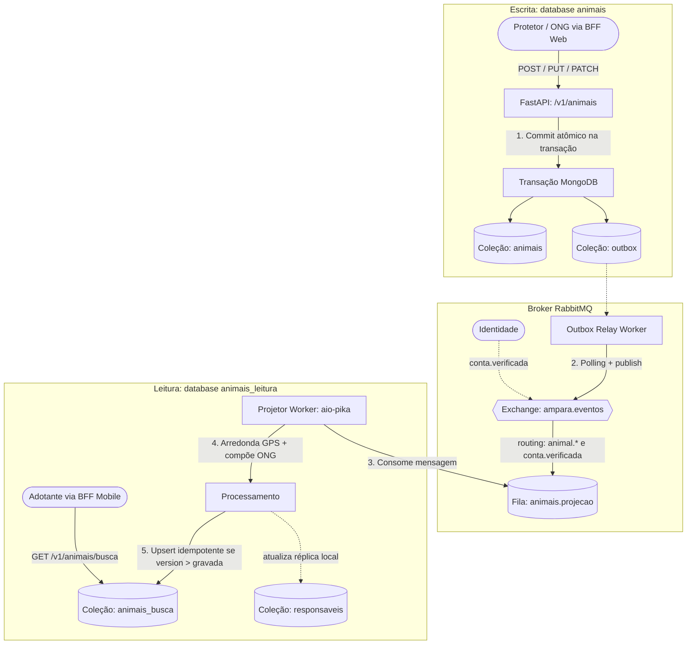

# CQRS no Serviço de Animais

- **Serviço:** Animais (`services/animais`)
- **Status:** Planejado para implementação nas issues #55 e #56 · Contrato formalizado na #21
- **Requisitos do enunciado:** RA-20, RA-21, RF-03 · ADR associada: [ADR-004](decisoes/ADR-004-cqrs-animais.md)

---

## 1. Por que Animais se beneficia de CQRS?

O padrão **CQRS (Command Query Responsibility Segregation)** separa fisicamente os caminhos de escrita (*Commands*) e de leitura (*Queries*). No projeto Ampara, o serviço de Animais é o ponto focal ideal para a aplicação deste padrão por três razões centrais:

1. **Assimetria extrema de carga (Read-Heavy):**
   - **Poucas escritas:** Apenas protetores e ONGs cadastram, editam ou alteram o status de animais (volume baixo e esporádico ao longo do dia).
   - **Muitas leituras:** Milhares de potenciais adotantes utilizam o App Mobile para navegar pelo feed e buscar animais próximos por geolocalização contínua (alto volume e concorrência).
2. **Assimetria de dados e privacidade (LGPD):**
   - O modelo de escrita exige dados cadastrais ricos e sensíveis: endereço residencial completo (rua, número, complemento, CEP), coordenadas GPS exatas, histórico médico e histórico de transições de status.
   - O modelo de leitura pública do adotante exige anonimização por segurança (LGPD): nunca expõe rua ou coordenadas exatas. Em vez disso, precisa de dados pré-calculados para a tela do celular: `distanciaKm` relativa, coordenadas arredondadas em grade de ~500 m (`pontoAproximado`), imagens em miniatura (`fotoThumb`) e dados desnormalizados da ONG.
3. **Desnormalização entre fronteiras sem chamadas síncronas:**
   - Na listagem de busca do mobile, cada card precisa exibir se a ONG é confiável (`responsavel.nome` e `responsavel.verificado`).
   - Sem CQRS, cada requisição de busca exigiria fazer chamadas HTTP síncronas ao serviço de Identidade ou carregar dados pesados de relacionamento.
   - Com o read model desnormalizado, o projetor embute esses dados a partir de eventos assíncronos (`conta.verificada`), servindo a busca em uma única consulta indexada.

---

## 2. Comparação dos Modelos de Escrita e Leitura

Os dois modelos residem em databases separados na mesma instância do MongoDB (`mongo-animais` em replica set `rs0`):
- **Escrita:** database `animais`, coleção `animais`.
- **Leitura:** database `animais_leitura`, coleção `animais_busca`.

```javascript
// ==========================================
// 1. MODELO DE ESCRITA (animais.animais)
// Normalizado, privado, dados auditáveis
// ==========================================
{
  "_id": ObjectId("6706e21b7a2d4b8e2194cf01"),
  "responsavelId": "5aa91cf0-3811-4fe5-bb4f-4fdbef3e1d55", // UUID da Identidade
  "nome": "Pipoca",
  "especie": "CAO",                                          // CAO | GATO | OUTRO
  "porte": "PEQUENO",                                        // PEQUENO | MEDIO | GRANDE
  "sexo": "MACHO",                                           // MACHO | FEMEA
  "idadeMeses": 14,
  "temperamento": ["BRINCALHAO", "DOCIL"],
  "descricao": "Resgatado em ótimo estado, vacinado e dócil.",
  "fotos": [
    "https://assets.ampara.dev/fotos/pipoca-1.webp",
    "https://assets.ampara.dev/fotos/pipoca-2.webp"
  ],
  "localizacao": {                                           // COORDENADA EXATA
    "type": "Point",
    "coordinates": [-44.999812, -21.246834]
  },
  "endereco": {                                              // ENDEREÇO COMPLETO (PRIVADO)
    "rua": "Rua Santana",
    "numero": "120",
    "complemento": "Apto 3",
    "bairro": "Centro",
    "cidade": "Lavras",
    "uf": "MG",
    "cep": "37200-000"
  },
  "status": "DISPONIVEL",                                    // DISPONIVEL | EM_TRATAMENTO | INDISPONIVEL | RESERVADO | ADOTADO
  "historicoStatus": [                                       // AUDITORIA DE TRANSIÇÕES
    {
      "status": "DISPONIVEL",
      "motivo": "Cadastro inicial",
      "alteradoEm": ISODate("2026-10-09T18:00:00Z"),
      "alteradoPor": "5aa91cf0-3811-4fe5-bb4f-4fdbef3e1d55"
    }
  ],
  "reservaSagaId": null,                                     // UUID da solicitação se RESERVADO
  "version": 1,                                              // Controle de concorrência / outbox
  "criadoEm": ISODate("2026-10-09T18:00:00Z"),
  "atualizadoEm": ISODate("2026-10-09T18:00:00Z")
}

// ==========================================
// 2. MODELO DE LEITURA (animais_leitura.animais_busca)
// Desnormalizado, anonimizado, otimizado para o mobile
// ==========================================
{
  "_id": ObjectId("6706e21b7a2d4b8e2194cf01"),
  "nome": "Pipoca",
  "especie": "CAO",
  "porte": "PEQUENO",
  "sexo": "MACHO",
  "idadeMeses": 14,
  "temperamento": ["BRINCALHAO", "DOCIL"],
  "descricao": "Resgatado em ótimo estado, vacinado e dócil.",
  "fotos": [
    "https://assets.ampara.dev/fotos/pipoca-1.webp",
    "https://assets.ampara.dev/fotos/pipoca-2.webp"
  ],
  "fotoCapa": "https://assets.ampara.dev/fotos/pipoca-1.webp",
  "fotoThumb": "https://assets.ampara.dev/fotos/pipoca-thumb.webp",
  "pontoAproximado": {                                       // GRADE APROXIMADA ~500m (LGPD)
    "type": "Point",
    "coordinates": [-45.000, -21.247]
  },
  "bairro": "Centro",                                        // APENAS BAIRRO E CIDADE
  "cidade": "Lavras",
  "responsavel": {                                           // DADOS DESNORMALIZADOS DA ONG
    "id": "5aa91cf0-3811-4fe5-bb4f-4fdbef3e1d55",
    "nome": "ONG Patas Amigas",
    "verificado": true
  },
  "status": "DISPONIVEL",                                    // GUARDA TODOS OS STATUS
  "version": 1,                                              // Usado para upsert idempotente
  "atualizadoEm": ISODate("2026-10-09T18:00:02Z")            // Timestamp para medir defasagem
}
```

### Índices do Read Model (`animais_busca`):
- Índice geoespacial: `db.animais_busca.createIndex({ "pontoAproximado": "2dsphere" })`
- Índice composto de filtros: `db.animais_busca.createIndex({ "status": 1, "especie": 1, "porte": 1 })`

### Preservação de todos os status na Projeção:
O read model armazena documentos em **qualquer status** (`DISPONIVEL`, `EM_TRATAMENTO`, `INDISPONIVEL`, `RESERVADO`, `ADOTADO`):
- A rota de busca pública `GET /v1/animais/busca` filtra automaticamente `status: "DISPONIVEL"`. Animais reservados ou adotados somem da listagem pública instantaneamente quando a projeção é atualizada.
- A rota de detalhe público `GET /v1/animais/busca/{id}` permite consultar o animal em qualquer status. Isso garante que um adotante que já possua o link ou esteja no fluxo da SAGA consiga visualizar a ficha pública sem receber erro 404.

---

## 3. Fluxo de Atualização da Projeção

A sincronização entre a escrita e a leitura é 100% assíncrona e orientada a eventos, utilizando o **Transactional Outbox Pattern** para evitar dual write.



### Passo a passo da atualização:

1. **Escrita no Modelo de Comando:**
   - A ONG cadastra ou edita o animal via `POST /v1/animais` ou `PUT /v1/animais/{id}`.
   - O serviço incrementa `version = version + 1`, grava o documento em `animais.animais` e insere o evento correspondente (`animal.criado`, `animal.atualizado` ou `animal.status_alterado`) na coleção `animais.outbox`, tudo na **mesma transação atômica** do MongoDB.
2. **Publicação pelo Relay:**
   - O processo de relay lê registros pendentes na coleção `outbox`, publica no exchange `ampara.eventos` com confirmação do broker (*publisher confirms*) e marca o registro como publicado.
3. **Consumo pelo Projetor:**
   - O worker de projeção de Animais escuta a fila dedicada `animais.projecao`.
   - Ao receber `animal.*`:
     - Aplica o algoritmo de privacidade: trunca as coordenadas GPS para uma grade de ~500 m (`pontoAproximado`), descartando logradouro e número.
     - Lê da coleção local `animais.responsaveis` o nome e status de verificação da ONG.
     - Executa um **upsert idempotente** na coleção `animais_leitura.animais_busca`:
       ```javascript
       db.animais_busca.updateOne(
         { _id: evento.animalId, version: { $lt: evento.version } },
         { $set: { ...dadosProjetados, version: evento.version, atualizadoEm: new Date() } },
         { upsert: true }
       )
       ```
   - Ao receber `conta.verificada` da Identidade:
     - Atualiza a coleção local de leitura `animais.responsaveis`.
     - Atualiza em lote o campo embutido `responsavel.verificado = true` em todos os documentos de `animais_busca` pertencentes àquela ONG.
4. **Idempotência e Tolerância a Mensagens Fora de Ordem:**
   - Caso o RabbitMQ reentregue a mesma mensagem ou mensagens cheguem fora de ordem, o filtro `version: { $lt: evento.version }` garante que versões antigas jamais sobrescrevam snapshots mais recentes.

---

## 4. Defasagem Aceitável e Como Medir na Demonstração

### Defasagem Alvo
- **SLA de consistência eventual:** $p95 \le 5\text{ s}$ sob condições normais de operação.
- A latência ponta a ponta é composta por:
  $$\text{Latência total} = \text{Intervalo do Relay } (\approx 500\text{ ms}) + \text{Trânsito RabbitMQ } (\approx 50\text{ ms}) + \text{Execução do Projetor } (\approx 100\text{ ms}) \le 1\text{ s}$$

### Resiliência a Falhas do Projetor
Se o worker de projeção ou o RabbitMQ caírem:
- A escrita continua funcionando normalmente (o outbox acumula mensagens seguras no MongoDB).
- A busca pública continua atendendo adotantes normalmente, sem erros 500, servindo o estado anterior do read model (*graceful degradation*).
- Quando o projetor for reiniciado, ele drena a fila `animais.projecao` e atualiza todos os documentos pendentes de forma idempotente.

### Roteiro de Medição na Demonstração ao Vivo (Parte 4 - Requisito RF-03)
1. **Passo 1 (Escrita):** Pelo painel do App Web, a ONG cadastra um novo animal chamado `"Thor"` às `10:00:00`.
2. **Passo 2 (Leitura imediata):** Imediatamente após a confirmação da escrita, chama-se `GET /v1/animais/busca?lat=...&lng=...`.
3. **Passo 3 (Verificação de consistência eventual):**
   - O item retornado trará:
     - `nome: "Thor"`
     - `atualizadoEm: "2026-10-09T10:00:02Z"`
   - A diferença entre o horário da requisição de escrita e o campo `atualizadoEm` comprova a defasagem real (ex.: 2 segundos), demonstrando o funcionamento ao vivo da consistência eventual e do read model.

---

## 5. Procedimento de Reconstrução (*Rebuild*) do Read Model

Caso a base de leitura seja corrompida, sofra perda de dados ou o formato de projeção mude em novas versões, o modelo de leitura pode ser **reconstruído do zero** sem qualquer indisponibilidade no modelo de escrita:

1. **Execução do Script de Reconstrução:**
   Executar o script administrativo `services/animais/scripts/reconstruir_projecao.py` (#56):
   ```bash
   python scripts/reconstruir_projecao.py --mongo-url "$ANIMAIS_MONGO_URL" --leitura-url "$ANIMAIS_LEITURA_MONGO_URL"
   ```
2. **Passos executados pelo script:**
   - 1. Cria uma coleção temporária `animais_leitura.animais_busca_temp`.
   - 2. Recria os índices geoespacial `2dsphere` em `pontoAproximado` e de filtros na coleção temporária.
   - 3. Itera via *cursor streaming* sobre todos os documentos de `animais.animais`.
   - 4. Para cada documento, aplica a função pura de projeção (arredondamento geoespacial e dados da ONG) e insere na coleção temporária.
   - 5. Realiza a troca atômica de coleções no MongoDB (`renameCollection` com `dropTarget: true`):
     ```javascript
     db.animais_busca_temp.renameCollection("animais_busca", true)
     ```
3. **Resultado:**
   A busca volta a refletir 100% dos dados originais sem que o modelo de escrita precise ser parado ou colocado em modo somente-leitura.

---

## 6. Alternativas Rejeitadas

- **CQRS no Serviço de Adoção:** Foi considerado criar um read model para o painel de solicitações da ONG. Rejeitado para o MVP porque a complexidade de manter projeções de um processo com transições frequentes de SAGA não justificaria o ganho neste momento; mantido no backlog pós-MVP (#77).
- **Elasticsearch como banco do Read Model:** Foi avaliado utilizar o Elasticsearch para a busca geográfica. Rejeitado porque introduziria mais uma tecnologia de banco de dados pesada no cluster local (enunciado já exige 2 PostgreSQL, 1 MongoDB, 1 Redis e 1 Qdrant), enquanto o MongoDB já oferece indexação geoespacial nativa `2dsphere` com desempenho suficiente para a demanda da plataforma.
