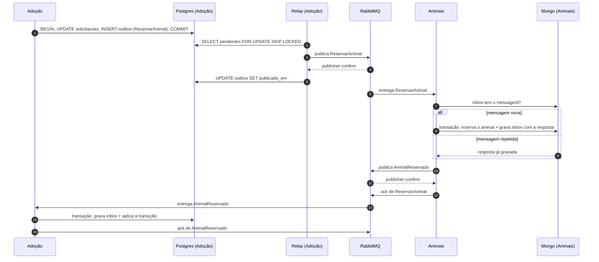

# Dados

Cada serviço da Ampara tem o próprio banco, e nenhum serviço lê o banco de outro. Este documento justifica cada banco, aponta onde a consistência é eventual e mostra como o outbox e a inbox resolvem a gravação dupla (*dual write*).

<!-- Seções 1 a 4: escritas na #31 (Gabriel Cantanhede). -->

## 1. Um banco por serviço

*A escrever na #31.*

## 2. Pontos de consistência eventual

*A escrever na #31.*

## 3. Riscos de dual write

*A escrever na #31. A mitigação de cada risco está na seção 5.*

## 4. Como isso será evidenciado na Parte 4

*A escrever na #31.*

## 5. Outbox e inbox

O dual write mais perigoso da Ampara está no orquestrador: a Adoção grava o novo estado da SAGA e precisa publicar o próximo comando. Se cair entre as duas coisas, a solicitação fica parada num estado que ninguém vai mover, ou um comando sai sem que o estado tenha sido gravado. A solução combina duas peças:

- **Outbox no produtor:** a mensagem é gravada como uma linha no mesmo banco, na mesma transação da mudança de estado. Um processo separado, o relay, publica essa linha depois.
- **Inbox no consumidor:** cada mensagem processada é registrada pelo `messageId`, na mesma transação do efeito. Uma mensagem repetida é reconhecida e não aplica o efeito de novo.

Uma peça sem a outra não basta: o relay pode publicar a mesma linha duas vezes, então o outbox sozinho garante a entrega, mas não evita efeitos duplicados.

A escolha do padrão e as alternativas estão na [ADR-003](decisoes/ADR-003-outbox.md). Os nomes de exchanges, filas e mensagens seguem o [catálogo](contratos/eventos.md).

### 5.1 Onde há outbox

| Serviço | Banco | O que sai pelo outbox | Intervalo do relay |
| --- | --- | --- | --- |
| Adoção | PostgreSQL (`postgres-adocao`) | comandos e eventos da SAGA (`ReservarAnimal`, `adocao.*` e os demais) | 200 ms |
| Animais | MongoDB (`mongo-animais`) | `animal.criado`, `animal.atualizado`, `animal.status_alterado` | 500 ms |
| Identidade | PostgreSQL (`postgres-identidade`) | `conta.verificada` | 1 s |

As **respostas** dos participantes da SAGA (`AnimalReservado`, `PerfilValidado` e as outras) não passam por outbox. A seção 5.5 explica por quê.

### 5.2 Adoção: tabelas

```sql
CREATE TABLE outbox (
  id            BIGSERIAL PRIMARY KEY,          -- ordem de gravação, usada pelo relay
  message_id    UUID NOT NULL UNIQUE,           -- messageId do envelope; mantido em todo reenvio
  saga_id       UUID NOT NULL,                  -- id da solicitação
  tipo          TEXT NOT NULL,                  -- ex.: ReservarAnimal, adocao.aprovada
  exchange      TEXT NOT NULL,                  -- ampara.comandos ou ampara.eventos
  routing_key   TEXT NOT NULL,                  -- ex.: animais, adocao.aprovada
  payload       JSONB NOT NULL,                 -- envelope completo, pronto para publicar
  criado_em     TIMESTAMPTZ NOT NULL DEFAULT now(),
  publicado_em  TIMESTAMPTZ
);
CREATE INDEX outbox_pendentes ON outbox (id) WHERE publicado_em IS NULL;

CREATE TABLE inbox (
  message_id    UUID PRIMARY KEY,               -- messageId da resposta recebida
  tipo          TEXT NOT NULL,                  -- ex.: AnimalReservado
  processada_em TIMESTAMPTZ NOT NULL DEFAULT now()
);
```

Toda transição da SAGA segue o mesmo roteiro, numa transação só: `SELECT … FOR UPDATE` na solicitação, `UPDATE solicitacoes`, `INSERT` em `saga_historico` e um `INSERT` em `outbox` por mensagem a enviar. Só depois vem o `COMMIT`.

### 5.3 Relay

```text
a cada 200 ms:
  BEGIN
    SELECT * FROM outbox
     WHERE publicado_em IS NULL
     ORDER BY id
     LIMIT 100
     FOR UPDATE SKIP LOCKED
    para cada linha:
      publica payload em (exchange, routing_key), com message_id, type e correlation_id nas propriedades AMQP
      espera o publisher confirm
    UPDATE outbox SET publicado_em = now() WHERE id IN (linhas confirmadas)
  COMMIT
```

- **Publisher confirms:** a linha só é marcada depois que o broker confirmou que gravou a mensagem. Sem confirm, a linha continua pendente e volta no ciclo seguinte.
- **`FOR UPDATE SKIP LOCKED`:** duas réplicas do relay pegam lotes diferentes, sem publicar a mesma linha ao mesmo tempo. É isso que permite escalar a Adoção.
- **Ordem:** com uma réplica, as mensagens saem na ordem do `id`. Com duas, mensagens da mesma SAGA podem sair fora de ordem. Isso é aceito porque nenhum consumidor depende da ordem de chegada (#91): as compensações C1 e C2 são independentes, um comando que chega depois da própria compensação é recusado pela marca `sagas_compensadas`, a projeção descarta eventos com `version` antiga e Notificações ordena a caixa por `occurredAt`.
- **Limpeza:** um job diário apaga as linhas publicadas há mais de 7 dias.

### 5.4 Animais: outbox no MongoDB

Animais grava o animal e o evento na mesma transação multidocumento:

```text
session.start_transaction():
  animais.update_one({_id, ...}, {$set: ..., $inc: {version: 1}})
  outbox.insert_one({messageId, type, routingKey, payload, criadoEm, publicadoEm: null})
commit
```

- **Replica set:** transação multidocumento só existe em replica set, mesmo com um nó só. Por isso o `mongo-animais` roda como **replica set de 1 nó (`rs0`)**. Replica set com autenticação exige um *keyFile*: a imagem própria `infra/mongo/` (#37) gera o arquivo no volume na primeira subida.
- **Relay:** a cada 500 ms, lê até 100 documentos com `publicadoEm: null` ordenados por `criadoEm`, publica com confirm e marca `publicadoEm`. Sem `SKIP LOCKED` no MongoDB, cada réplica marca o lote que pegou com `findOneAndUpdate` (campo `reservadoAte`), e outra réplica só pega documentos com a reserva vencida.
- **Limpeza:** um índice TTL em `publicadoEm` apaga os eventos publicados depois de 7 dias. O TTL ignora documentos com `publicadoEm: null`, então nada pendente se perde.
- **Plano B, se o replica set der problema:** guardar os eventos pendentes dentro do próprio documento do animal (um array `eventosPendentes`). Uma escrita num único documento já é atômica, então não precisa de transação. O custo é o relay varrer a coleção principal e o documento crescer até o evento ser publicado. Fica registrado na ADR-003 como alternativa.

O consumidor desses eventos é o projetor de Animais (#33 e #56), que faz upsert por `version` no read model.

### 5.5 Inbox nos consumidores

| Consumidor | Onde | Guarda a resposta? |
| --- | --- | --- |
| Animais (comandos da SAGA) | coleção `inbox` (`_id = messageId`, `resposta`, TTL de 7 dias) | sim |
| Identidade (comandos da SAGA) | tabela `inbox` (`message_id`, `tipo`, `resposta`, `processada_em`) | sim |
| Adoção (respostas) | tabela `inbox` (seção 5.2) | não precisa |
| Animais (projeção) | não usa: o upsert por `version` já é idempotente | — |
| Notificações | chave por `messageId` no Redis | não precisa |

**Por que as respostas não usam outbox.** O participante faz, numa transação: aplica o efeito e grava na inbox o `messageId` do comando **com a resposta pronta**. Depois do commit, publica a resposta com confirm e só então faz o `ack` do comando.

Se ele cair depois do commit e antes do `ack`, o RabbitMQ entrega o comando de novo. A inbox encontra o `messageId` e o participante publica a **mesma** resposta, sem aplicar o efeito outra vez. A inbox cumpre o papel do outbox aqui, então uma segunda tabela não acrescentaria nada.

O mesmo vale quando a Adoção reenvia um comando por timeout: o reenvio usa o mesmo `messageId`, então cai na inbox e recebe a resposta já gravada.

### 5.6 Fluxo completo



### 5.7 O que acontece em cada queda

| Momento da queda | O que acontece | Por que está ok |
| --- | --- | --- |
| Produtor cai antes do commit | nada foi gravado, nada sai | o cliente recebe erro e pode repetir; o `Idempotency-Key` evita duas solicitações |
| Produtor cai depois do commit, antes de publicar | a linha fica pendente no outbox | o relay (o mesmo processo ao voltar, ou outra réplica) publica no próximo ciclo |
| Relay cai depois de publicar, antes de marcar `publicado_em` | a mensagem sai de novo, com o mesmo `messageId` | a inbox do consumidor descarta a repetida |
| RabbitMQ fora do ar | o publish falha ou fica sem confirm; a linha continua pendente | o serviço continua aceitando escritas, e as mensagens saem quando o broker volta |
| Consumidor cai antes do commit | o efeito não foi aplicado e a mensagem não teve `ack` | o RabbitMQ entrega de novo e o processamento recomeça do zero |
| Consumidor cai depois do commit, antes de publicar a resposta | a mensagem volta | a inbox encontra a resposta gravada e o participante a publica |
| Consumidor cai depois de publicar a resposta, antes do `ack` | a mensagem volta e a resposta sai duas vezes | o participante republica a mesma resposta; a inbox da Adoção descarta a segunda |
| Mensagem falha 5 vezes seguidas | vai para a DLQ | alerta, reprocessamento manual com o mesmo `messageId` e teto de reenvios na Adoção (catálogo, seção 6; #86) |

### 5.8 Garantia resultante

O RabbitMQ entrega **pelo menos uma vez**: em caso de queda, a mesma mensagem pode chegar de novo. Com a inbox, cada mensagem tem efeito **uma única vez**. A soma das duas peças dá o resultado que importa para o negócio: nenhuma mensagem se perde e nenhum efeito se repete.
