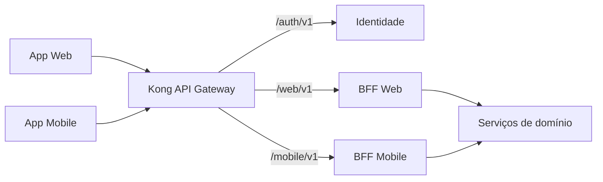

# API Gateway

O Kong DB-less é a única entrada dos clientes. Ele aplica políticas de borda e
encaminha para os BFFs ou, no caso de autenticação, para a Identidade. Serviços
de domínio não possuem rota externa.

## Rotas externas

| Nome | Rota externa | Destino interno | Autenticação | Limite | Roles esperadas |
| --- | --- | --- | --- | --- | --- |
| `auth` | `/auth/v1/*` | `identidade:3001/v1/auth/*` | Pública | 20/min por IP | — |
| `mobile-publico` | GET `/mobile/v1/animais*` | `bff-mobile:3020` | Pública; se vier token, o BFF valida assinatura e `exp` antes de usar | 600/min por IP | — |
| `mobile` | `/mobile/v1/*` | `bff-mobile:3020` | JWT RS256 | 600/min por IP | ADOTANTE |
| `web` | `/web/v1/*` | `bff-web:3010` | JWT RS256 | 300/min por IP | PROTETOR, ONG, ADMIN |

Somente o prefixo de autenticação da Identidade é exposto. As rotas de contas,
perfil e verificação permanecem na rede interna.



### Regra das URLs e versões

Toda rota externa segue o formato `/<cliente>/v<versão maior>/...`: `/web/v1`,
`/mobile/v1` e `/auth/v1`. As rotas internas dos serviços usam só `/v<versão>/...`
e nunca aparecem para o cliente.

As duas versões são **eixos independentes**. O `v1` de `/web/v1` é a versão do
contrato do BFF Web com o App Web; o `v1` de `/v1/solicitacoes` é a versão do
contrato da Adoção com os BFFs. Se a Adoção publicar uma `v2`, o BFF Web passa a
consumi-la e continua expondo `/web/v1` enquanto o contrato dele com o cliente
não mudar. Uma `/web/v2` só surge quando o próprio BFF quebra esse contrato.

Alternativas rejeitadas (#124): prefixo único `/api/<cliente>/v1`, que muda o BFF
Web, os testes e a reescrita dos `_links` sem ganho para um host que só serve API;
e login pelos BFFs, que tiraria a Identidade do gateway mas exigiria rotas de
sessão nos dois BFFs, com o BFF Mobile ainda inexistente.

## Responsabilidades

- Valida assinatura RS256 e expiração do JWT nas rotas autenticadas. A chave
  pública vem de `JWT_PUBLIC_KEY`, injetada ao gerar o arquivo declarativo.
- Limita requisições conforme a tabela.
- Gera e propaga `X-Correlation-Id`, para que BFFs e serviços possam correlacionar
  logs e eventos.
- Aplica CORS ao App Web.

A autorização tem três camadas: o Kong verifica assinatura e `exp`; o BFF
verifica a role compatível com o cliente; e o serviço decide a permissão sobre
o recurso, como ser o dono de um animal. O Gateway não toma decisões de negócio
nem infere a role a partir de uma rota.

## O que não fica no Gateway

| Responsabilidade | Onde fica | Motivo |
| --- | --- | --- |
| Agregar e formatar dados por cliente | BFF Web e BFF Mobile | Cada cliente precisa de payloads e chamadas diferentes. |
| Regras de adoção, animais ou contas | Serviços de domínio | A regra permanece perto dos dados e do domínio responsável. |
| Decidir propriedade de um recurso | Serviço de domínio | Depende do recurso persistido, não apenas do token. |

## Como isso vira Ingress na Parte 3

As quatro rotas serão representadas por objetos `Ingress` com
`ingressClassName: kong`, preservando caminhos, métodos e destinos desta tabela.
As políticas de JWT, rate limit, correlation ID e CORS serão associadas por
`KongPlugin`; o consumidor `ampara-identidade` e sua credencial RS256 serão um
`KongConsumer`, conforme as issues #46 e #50. Assim o roteamento de Kubernetes
repete, em vez de reinterpretar, a decisão registrada aqui.

## Arquivo declarativo

`gateway/kong.template.yml` é um rascunho DB-less para a configuração local.
Ele não contém segredo: a chave pública de JWT é fornecida pelo ambiente ao
gerar a configuração. Para preservar as quebras de linha no valor YAML, a
variável deve conter `\n` escapado, por exemplo:

```bash
JWT_PUBLIC_KEY="$(awk '{printf "%s\\n", $0}' jwt.pub)" \
  envsubst < gateway/kong.template.yml > /tmp/kong.yml
```
