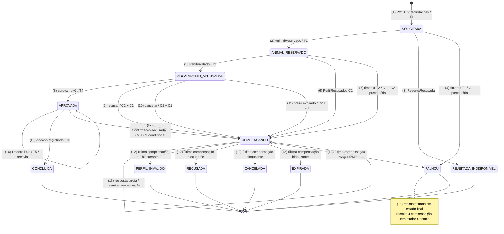
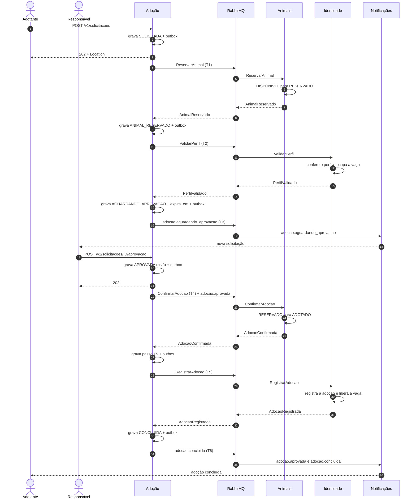
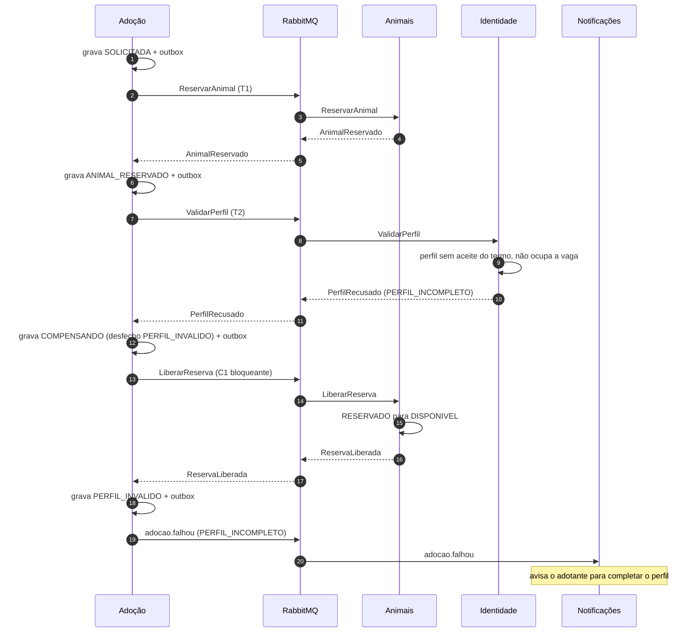
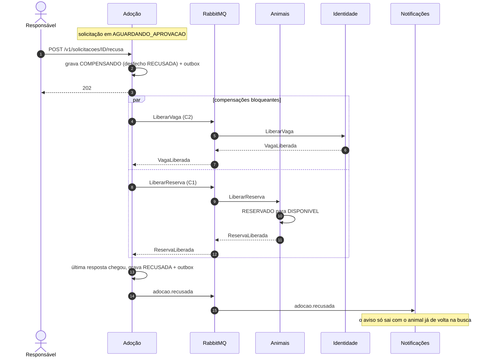
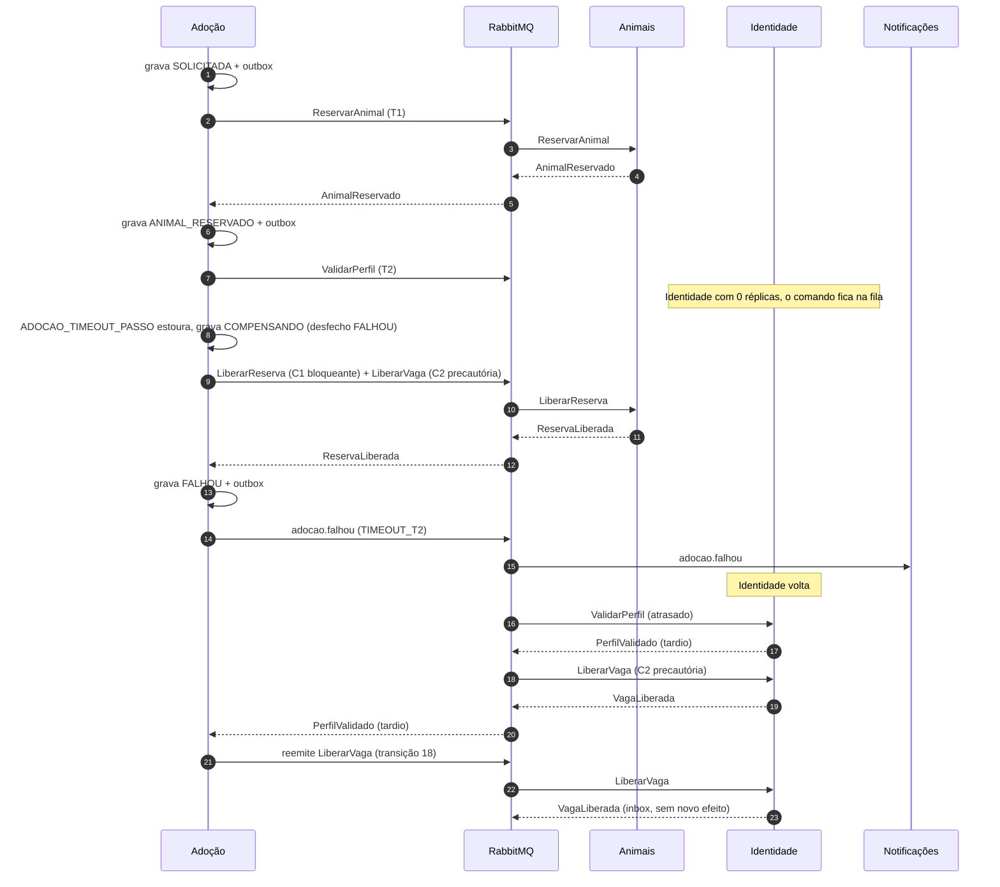

# SAGA de adoção

Este documento modela a SAGA que leva uma solicitação de adoção do pedido até a conclusão ou o encerramento. Ela é **orquestrada** pelo serviço de Adoção e conversa com os participantes (Animais, Identidade e Notificações) por **comandos e respostas no RabbitMQ**. A justificativa está na [ADR-002](decisoes/ADR-002-saga-orquestrada.md).

Os nomes de estados seguem o contrato [`adocao.v1.yaml`](contratos/adocao.v1.yaml). Os nomes de comandos, respostas e eventos seguem o catálogo de mensagens (`docs/contratos/eventos.md`, #25).

## 1. Máquina de estados

A solicitação tem 5 estados ativos e 7 finais.

- **Ativos:** `SOLICITADA`, `ANIMAL_RESERVADO`, `AGUARDANDO_APROVACAO`, `APROVADA` e `COMPENSANDO`.
- **Finais:** `CONCLUIDA`, `REJEITADA_INDISPONIVEL`, `PERFIL_INVALIDO`, `RECUSADA`, `CANCELADA`, `EXPIRADA` e `FALHOU`.

Não existe estado de "perfil validado": o T3 é um evento publicado na mesma transação que grava `AGUARDANDO_APROVACAO`. Enquanto está em `COMPENSANDO`, a solicitação guarda no campo `desfecho` o estado final que será gravado quando as compensações terminarem.

Os números entre parênteses são os da [tabela de transições](#3-transições).

## 2. Passos

| Passo | Mensagem | Participante | Efeito | Respostas | Compensação |
| --- | --- | --- | --- | --- | --- |
| T1 | `ReservarAnimal` | Animais | `DISPONIVEL` → `RESERVADO` | `AnimalReservado` · `ReservaRecusada` | C1 `LiberarReserva` → `ReservaLiberada` |
| T2 | `ValidarPerfil` | Identidade | confere o perfil de adoção e ocupa a vaga (1 solicitação ativa por adotante) | `PerfilValidado` · `PerfilRecusado` | C2 `LiberarVaga` → `VagaLiberada` |
| T3 | `adocao.aguardando_aprovacao` (evento) | Notificações | avisa o responsável | — | não tem: só avisa e pode ser repetido |
| **Pivô** | aprovação humana | Adoção | — | — | — |
| T4 | `ConfirmarAdocao` | Animais | `RESERVADO` → `ADOTADO` | `AdocaoConfirmada` · `ConfirmacaoRecusada` | não tem: retentável |
| T5 | `RegistrarAdocao` | Identidade | registra a adoção no histórico do adotante e libera a vaga | `AdocaoRegistrada` | não tem: retentável |
| T6 | `adocao.concluida` (evento) | Notificações | avisa o adotante e o responsável | — | não tem: retentável |

O **pivô** é a aprovação do responsável. Antes dele, toda falha desfaz o que já foi feito. Depois dele, T4, T5 e T6 só são reenviados até dar certo, nunca compensados. A única exceção é a invariante quebrada da transição 17.

Os motivos de recusa vêm no payload da resposta:

- `ReservaRecusada`: `INDISPONIVEL`, `INEXISTENTE` ou `SAGA_ENCERRADA`;
- `PerfilRecusado`: `PERFIL_INCOMPLETO`, `LIMITE_SOLICITACOES`, `CONTA_INEXISTENTE` ou `SAGA_ENCERRADA`.

`SAGA_ENCERRADA` é a [defesa dos participantes](#7-defesa-nos-participantes) contra comandos que chegam depois da compensação.

## 3. Transições

Há dois tipos de compensação:

- **Bloqueante:** desfaz um passo **confirmado**. O estado final só é gravado quando a resposta dela chega. Por isso o aviso de encerramento já significa que o animal voltou para a busca.
- **Precautória:** desfaz um passo de resultado **incerto**, depois de um timeout. Sai pelo outbox, mas não segura o estado final. Como as filas são duráveis, ela é entregue quando o participante voltar.

| # | De | Gatilho | Para | Outbox emite |
| --- | --- | --- | --- | --- |
| 1 | — | `POST /v1/solicitacoes` | `SOLICITADA` | `ReservarAnimal` (T1) |
| 2 | `SOLICITADA` | `AnimalReservado` | `ANIMAL_RESERVADO` | `ValidarPerfil` (T2) |
| 3 | `SOLICITADA` | `ReservaRecusada` | `REJEITADA_INDISPONIVEL` | `adocao.falhou` (sem compensação) |
| 4 | `SOLICITADA` | timeout do T1 | `FALHOU` | `LiberarReserva` (C1 precautória) + `adocao.falhou` |
| 5 | `ANIMAL_RESERVADO` | `PerfilValidado` | `AGUARDANDO_APROVACAO` (grava `expira_em`) | `adocao.aguardando_aprovacao` (T3) |
| 6 | `ANIMAL_RESERVADO` | `PerfilRecusado` | `COMPENSANDO` (desfecho `PERFIL_INVALIDO`) | `LiberarReserva` (C1 bloqueante) |
| 7 | `ANIMAL_RESERVADO` | timeout do T2 | `COMPENSANDO` (desfecho `FALHOU`) | C1 bloqueante + `LiberarVaga` (C2 precautória) |
| 8 | `AGUARDANDO_APROVACAO` | aprovação | `APROVADA` | `ConfirmarAdocao` (T4) + `adocao.aprovada` |
| 9 | `AGUARDANDO_APROVACAO` | recusa | `COMPENSANDO` (desfecho `RECUSADA`) | C2 + C1, ambas bloqueantes |
| 10 | `AGUARDANDO_APROVACAO` | cancelamento | `COMPENSANDO` (desfecho `CANCELADA`) | C2 + C1, ambas bloqueantes |
| 11 | `AGUARDANDO_APROVACAO` | `expira_em` vencido | `COMPENSANDO` (desfecho `EXPIRADA`) | C2 + C1, ambas bloqueantes |
| 12 | `COMPENSANDO` | última resposta bloqueante (`ReservaLiberada` ou `VagaLiberada`) | o desfecho gravado | `adocao.recusada`, `adocao.cancelada`, `adocao.expirada` ou `adocao.falhou` |
| 13 | `COMPENSANDO` | timeout de uma compensação | `COMPENSANDO` | reenvia o mesmo comando, com o mesmo `messageId` e backoff; não desiste; log ERROR a partir da 10ª tentativa |
| 14 | `APROVADA` (passo T4) | `AdocaoConfirmada` | `APROVADA` (passo T5) | `RegistrarAdocao` (T5) |
| 15 | `APROVADA` (passo T5) | `AdocaoRegistrada` | `CONCLUIDA` | `adocao.concluida` (T6) |
| 16 | `APROVADA` | timeout do T4 ou do T5 | `APROVADA` | reenvia o mesmo comando (passo retentável, sem compensação) |
| 17 | `APROVADA` | `ConfirmacaoRecusada` (invariante violada) | `COMPENSANDO` (desfecho `FALHOU`) | C2 bloqueante + C1 condicional + log crítico |
| 18 | estado final ou `COMPENSANDO` | resposta positiva tardia (`AnimalReservado` ou `PerfilValidado`) | não muda | reemite a compensação correspondente (`LiberarReserva` ou `LiberarVaga`) |

Observações:

- **Transição 3:** `INDISPONIVEL` e `INEXISTENTE` terminam em `REJEITADA_INDISPONIVEL`, com o motivo gravado. Nada foi feito ainda, então não há o que compensar.
- **Transição 4:** a C1 é precautória porque não se sabe se o `ReservarAnimal` foi aplicado. Os dois comandos vão para a mesma fila (`animais.comandos`), na ordem em que foram publicados. Se a reserva chegou a acontecer, a liberação vem logo depois.
- **Transição 6:** só C1, porque a Identidade não ocupa a vaga quando recusa o perfil.
- **Transição 7:** a reserva foi confirmada (C1 bloqueante), mas não se sabe se a vaga foi ocupada (C2 precautória).
- **Transição 12:** nos desfechos `PERFIL_INVALIDO` e `FALHOU`, o evento é `adocao.falhou`, com o motivo no payload (`PERFIL_INCOMPLETO`, `LIMITE_SOLICITACOES`, `CONTA_INEXISTENTE`, `TIMEOUT_T2` ou `CONFIRMACAO_RECUSADA`). Nas transições 3 e 4, os motivos são `INDISPONIVEL`, `INEXISTENTE` e `TIMEOUT_T1`.
- **Transição 17:** acontece se o animal deixou de estar reservado para esta SAGA antes do T4, por exemplo por uma mudança manual de status. A C1 é condicional: Animais só libera a reserva se ela ainda pertencer a este `sagaId`, e responde `ReservaLiberada` mesmo quando não há nada a liberar.

## 4. Compensações por cenário

| # | Cenário | Onde falha | Transições | O que o orquestrador faz | Estado final | Evento |
| --- | --- | --- | --- | --- | --- | --- |
| 1 | Concorrência: animal já reservado por outra SAGA | T1 | 3 | encerra sem compensar | `REJEITADA_INDISPONIVEL` | `adocao.falhou` (`INDISPONIVEL`) |
| 2 | Animal inexistente | T1 | 3 | encerra sem compensar | `REJEITADA_INDISPONIVEL` | `adocao.falhou` (`INEXISTENTE`) |
| 3 | Timeout do T1 (Animais fora do ar) | T1 | 4 | C1 precautória | `FALHOU` | `adocao.falhou` (`TIMEOUT_T1`) |
| 4 | Timeout do T2 (Identidade fora do ar) | T2 | 7 → 12 | C1 bloqueante + C2 precautória | `FALHOU` | `adocao.falhou` (`TIMEOUT_T2`) |
| 5 | Timeout do T4 ou do T5 | depois do pivô | 16 | reenvia o mesmo comando até responder; não compensa | segue até `CONCLUIDA` | `adocao.concluida` |
| 6 | Perfil inválido (incompleto, limite de solicitações ou conta inexistente) | T2 | 6 → 12 | C1 bloqueante | `PERFIL_INVALIDO` | `adocao.falhou` (motivo da Identidade) |
| 7 | Recusa do responsável | decisão | 9 → 12 | C2 + C1 bloqueantes | `RECUSADA` | `adocao.recusada` |
| 8 | Cancelamento pelo adotante | decisão | 10 → 12 | C2 + C1 bloqueantes | `CANCELADA` | `adocao.cancelada` |
| 9 | Expiração do prazo | decisão | 11 → 12 | C2 + C1 bloqueantes | `EXPIRADA` | `adocao.expirada` |
| 10 | Notificações fora do ar | T3 ou T6 | — | nada: os eventos ficam na fila durável `notificacoes.eventos` e são entregues quando o serviço volta; a SAGA não espera por ele | não muda | entregue depois |
| 11 | `ConfirmacaoRecusada` (invariante violada) | T4 | 17 → 12 | C2 bloqueante + C1 condicional + log crítico | `FALHOU` | `adocao.falhou` (`CONFIRMACAO_RECUSADA`) |
| 12 | Timeout de uma compensação | C1 ou C2 | 13 | reenvia com o mesmo `messageId` e backoff, sem desistir; log ERROR a partir da 10ª tentativa | continua `COMPENSANDO` até a resposta | — |
| 13 | Resposta tardia (participante volta depois do timeout) | T1 ou T2 | 18 | reemite `LiberarReserva` ou `LiberarVaga` | não muda | — |
| 14 | Corrida entre aprovação e expiração | decisão | 8 ou 11 | `SELECT … FOR UPDATE` serializa as duas; quem pega o lock primeiro vence. Se a expiração venceu, a aprovação recebe 409; se a aprovação venceu, o verificador encontra `APROVADA` e não faz nada | `CONCLUIDA` ou `EXPIRADA` | o do vencedor |
| 15 | Clique duplo em aprovar | decisão | 8 | a segunda requisição encontra `APROVADA` e recebe 409; sai um único `ConfirmarAdocao` | `CONCLUIDA` | `adocao.concluida` |
| 16 | Mensagem duplicada (reentrega do RabbitMQ) | qualquer passo | — | a inbox do participante devolve a resposta já gravada; a inbox da Adoção descarta a resposta repetida; as duas fazem `ack` sem repetir o efeito | não muda | — |
| 17 | Queda do orquestrador | qualquer passo | — | o estado e o outbox estão no banco: ao subir, o relay publica o que ficou pendente, o verificador de timeouts trata os prazos vencidos e as respostas sem `ack` voltam da fila | retoma de onde parou | — |

## 5. Diagramas de sequência

### 5.1 Caminho feliz

### 5.2 Perfil incompleto (C1 bloqueante)

### 5.3 Recusa (C2 + C1)

### 5.4 Identidade fora do ar (falha técnica)

## 6. Regras do orquestrador

- **Estado e outbox na mesma transação.** Toda transição abre a transação, faz `SELECT … FOR UPDATE` na linha da solicitação, calcula a transição, grava `solicitacoes`, `saga_passos`, `saga_historico` e `outbox`, e só então faz o commit. Nenhuma mensagem é publicada fora do outbox.
- **Lock em toda transição.** O `FOR UPDATE` serializa aprovação, recusa, cancelamento, expiração e respostas que chegam ao mesmo tempo para a mesma solicitação.
- **Comandos idempotentes por `sagaId` + passo.** Cada passo tem uma linha em `saga_passos` com o `messageId` do comando.
- **Reenvio com o mesmo `messageId`.** Um comando reenviado por timeout mantém o `messageId`, para a inbox do participante devolver a resposta já gravada em vez de aplicar o efeito de novo.
- **Encerramento depois das compensações bloqueantes.** `adocao.recusada`, `adocao.cancelada`, `adocao.expirada` e o `adocao.falhou` que vem de `COMPENSANDO` só saem na transição 12.
- **Prazos configuráveis.** `ADOCAO_TIMEOUT_PASSO` define o timeout de cada passo (10 s). `ADOCAO_PRAZO_EXPIRACAO` define o prazo da decisão humana (72 h em produção, 2 min na demo, via ConfigMap).
- **Retomada ao reiniciar.** Nada fica em memória. Ao subir, o relay publica o outbox pendente e o verificador de timeouts trata os passos com prazo vencido.
- **Correlação.** Toda mensagem leva `sagaId` (igual ao id da solicitação) e `correlationId`, e todo log de transição registra `sagaId`, `correlationId`, `estado`, `passo` e `evento`.

## 7. Defesa nos participantes

Animais e Identidade guardam a marca `sagas_compensadas`: ao aplicar uma compensação (`LiberarReserva` ou `LiberarVaga`), registram o `sagaId`. Uma ação (`ReservarAnimal` ou `ValidarPerfil`) que chega depois disso para o mesmo `sagaId` é recusada com `SAGA_ENCERRADA`.

Isso cobre o caso em que a compensação precautória é processada antes do comando original, por exemplo quando o comando original é reentregue depois de uma queda do participante. Sem a marca, o animal ficaria reservado, ou a vaga ocupada, para uma SAGA que já terminou.

As respostas dos participantes não passam por outbox. O participante grava o efeito e a resposta na inbox na mesma transação, faz o commit, publica a resposta com *publisher confirm* e só então faz o `ack`. Se cair antes do `ack`, a mensagem volta, a inbox encontra a resposta gravada e o participante publica a mesma resposta de novo.

## 8. Como provocar cada falha na demo

| Cenário | Como provocar | O que mostrar |
| --- | --- | --- |
| Perfil incompleto | solicitar com o adotante do seed que não aceitou o termo de adoção | `PERFIL_INVALIDO`, animal de volta para `DISPONIVEL` e aviso ao adotante |
| Animal já reservado | dois adotantes solicitam o mesmo animal | o segundo termina em `REJEITADA_INDISPONIVEL` |
| Recusa | o responsável recusa pelo App Web | `COMPENSANDO` → `RECUSADA`, e o aviso só depois do animal liberado |
| Expiração | subir com `ADOCAO_PRAZO_EXPIRACAO=2m` e não decidir | `EXPIRADA` em cerca de 2 minutos |
| Identidade fora do ar | `kubectl scale deployment identidade --replicas=0` (no compose, `docker compose stop identidade`) e solicitar | depois de `ADOCAO_TIMEOUT_PASSO`, `FALHOU` com o animal liberado; ao voltar com `--replicas=1`, a vaga é liberada pela resposta tardia |
| Queda do orquestrador | `kubectl delete pod` da Adoção no meio de uma SAGA | o novo pod retoma a SAGA do ponto em que parou |

A linha do tempo (`GET /v1/solicitacoes/{id}/historico`) mostra cada transição, e os logs filtrados por `sagaId` mostram as mensagens trocadas.
